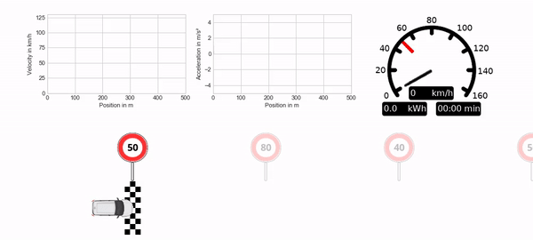
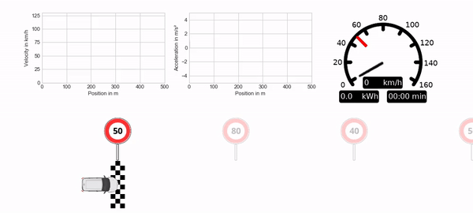

# gym-longicontrol

[](https://github.com/dynamik1703/gym_longicontrol/actions/workflows/ci.yml)

LongiControl is a Gymnasium environment for longitudinal control of an electric
vehicle. An agent controls acceleration on a one-dimensional track while
balancing travel speed, predicted energy use, jerk, and compliance with changing
speed limits.

The environment combines a data-derived BMW i3 power model with deterministic
or seeded stochastic tracks. It is intentionally compact enough for work on
multi-objective RL, Safe RL, and explainability while retaining physically
meaningful units and constraints. The environment was introduced in
[LongiControl: A Reinforcement Learning Environment for Longitudinal Vehicle
Control](https://doi.org/10.5220/0010305210301037).

## Installation

LongiControl requires Python 3.10 or newer.

```bash
python -m pip install .
```

The core installation is headless and depends only on Gymnasium and NumPy.
Install optional features explicitly:

```bash
python -m pip install ".[render]"  # visualization
python -m pip install ".[video]"   # video recording
python -m pip install ".[train]"   # bundled PyTorch SAC example
python -m pip install ".[examples]"  # SB3 demo, pretrained policy, Jupyter notebook
python -m pip install ".[morl]"    # CAPQL + SAC comparison (GMP; see guide below)
python -m pip install ".[dev]"     # tests, linting, and package builds
```

## Try a trained agent without training

From a repository checkout or extracted source distribution:

```bash
python -m pip install -e ".[examples]"
python -m examples.sb3_quickstart demo
python -m jupyterlab examples/quickstart.ipynb
```

The [getting-started guide](examples/README.md) includes a tested
Stable-Baselines3 SAC example, a **Run All** notebook, and a small bundled CPU
demonstration policy. The notebook plots a drive and compares the agent with a
random policy on identical seeded tracks. No model download or training is needed.
See the [model card](examples/models/sac_demo/README.md) for measured simulation
results and limitations; this is not an optimized or safety-validated controller.
Examples and demo weights are not installed by the wheel.

## Quick start

```python
import gymnasium as gym
import gym_longicontrol  # registers the environments

env = gym.make("gym_longicontrol:StochasticTrack-v1")
observation, info = env.reset(seed=42)

terminated = truncated = False
while not (terminated or truncated):
    action = env.action_space.sample()
    observation, reward, terminated, truncated, info = env.step(action)

print(info["position_m"], info["total_energy_kwh"])
env.close()
```

Available registered environments are:

- `DeterministicTrack-v1`: caller-defined speed-limit positions and values.
- `StochasticTrack-v1`: a new reproducible track is sampled at reset.

Both use a 1,000 m track, a 10 Hz simulation step, a 150 m sensor range, and a
registered 1,800-step time limit. Reach the finish to terminate; hit the time
limit to truncate.

### Deterministic track configuration

Positions are specified in kilometres and speed limits in kilometres per hour,
matching the original public API:

```python
env = gym.make(
    "gym_longicontrol:DeterministicTrack-v1",
    speed_limit_positions=[0.0, 0.25, 0.5, 0.75],
    speed_limits=[50, 80, 40, 50],
    reward_weights=[1.0, 0.5, 1.0, 1.0],
    energy_factor=1.0,
)
```

Configuration is validated when the environment is created. Invalid action
shapes, mismatched track arrays, missing initial limits, and out-of-range
`energy_factor` values fail with descriptive exceptions.

## Observation, action, and reward

The action is a one-element continuous array in `[-1, 1]`. It is mapped to a
velocity-dependent feasible acceleration using the vehicle's acceleration and
power limits.

The eight normalized observation features are, in order:

1. velocity;
2. previous acceleration;
3. current speed limit;
4. next speed limit;
5. second-next speed limit;
6. distance to the next speed limit;
7. distance to the second-next speed limit;
8. `energy_factor`, a policy context feature.

The scalar reward is the weighted sum of four signed components named
`forward`, `energy`, `jerk`, and `shock`. The individual values are available
under `info["reward_components"]`, making evaluation possible without
reimplementing the reward function.

For compatibility with published experiments, `energy_factor` remains a context
feature and does not itself scale the energy reward. Change
`reward_weights[1]` to alter the energy contribution.

The info mapping supplies explicit-unit keys such as `position_m`,
`velocity_m_s`, `velocity_km_h`, `acceleration_m_s2`, `elapsed_time_s`, and
`total_energy_kwh`. Short keys used by version 0.0.1 remain as transitional
aliases.

## Multi-objective RL

`MODeterministicTrack-v1` and `MOStochasticTrack-v1` expose the same dynamics
with four unweighted rewards in the order `forward, energy, jerk, shock`.
`reward_space` and `reward_dim` are available on the unwrapped environment.
These IDs work with MO-Gymnasium; scalar v1 IDs are unchanged. The vector
environments themselves need no extra dependency.

The optional [MORL guide](examples/morl/README.md) provides CAPQL and an SB3 SAC
weight sweep with equal total training budgets, separate seeded evaluation,
Pareto/hypervolume metrics, local checkpoints and headless plots. It explains
the GMP prerequisite for the `morl` extra. After installation, from a checkout:

```bash
python -m examples.morl_baselines --output runs/morl-comparison \
  --steps 50000 --train-seeds 42 43 44 --eval-seeds 1001 1002 1003
```

This is a reproducible starting point, not a tuned benchmark. Inspect completion
and speed-limit violations alongside rewards. `forward` measures speed-limit
tracking, not travel time; `shock` is not a collision-safety objective.

## Rendering

Install the `render` extra and select the mode while creating the environment:

```python
env = gym.make(
    "gym_longicontrol:DeterministicTrack-v1",
    render_mode="rgb_array",  # or "human"
)
observation, info = env.reset(seed=2)
frame = env.render()
```

No rendering package is imported during ordinary headless training.

## PyTorch SAC example

Run training from a repository checkout; the wheel intentionally installs only
the environment. The trainer is import-safe and uses the Gymnasium lifecycle:

```bash
python -m training \
  --env_id DeterministicTrack-v1 \
  --save_id 1 \
  --num_epochs 100 \
  --num_steps_per_epoch 1000
```

Resume a run or visualize a checkpoint with:

```bash
python -m training --env_id DeterministicTrack-v1 --load_id 1
python -m training --env_id DeterministicTrack-v1 --load_id 1 --visualize
python -m training --env_id DeterministicTrack-v1 --load_id 1 --visualize --record
```

Use the same environment, model and replay configuration when resuming.
Training outputs are saved under `rl/pytorch/out/<env>/SAC_id<id>/` by default;
use `--output_dir` to select another location. Checkpoints contain optimizer,
target-network, replay and RNG state; run configuration and histories are JSON.
Inspect a history with `python -m training.monitor path/to/seed2.json`.

The former `python rl/pytorch/main.py ...` entry point remains as a compatibility
wrapper. TensorFlow 1 DDPG and its SHAP notebook are retained only as historical
research artifacts and are not installed or tested.

## Development

```bash
python -m pip install -e ".[dev,render,video,train,legacy]"
python -m pytest
python -m ruff check .
python -m build
```

CI tests supported Python versions, builds both wheel and source distribution,
installs the wheel into a clean environment, and verifies that the vehicle and
rendering assets were packaged. Gymnasium's environment checker is part of the
test suite.

See [MIGRATION.md](MIGRATION.md) when updating code written for version 0.0.1.

## Model provenance

The bundled power estimator was originally trained from Argonne National
Laboratory [Downloadable Dynamometer Database](https://www.anl.gov/es/downloadable-dynamometer-database)
data. Version 1.0 stores only its fitted layers in a portable NumPy archive;
runtime code no longer imports scikit-learn or unpickles an estimator. Adjacent
JSON metadata records the source artifact hash, original sklearn version,
feature order, units, and layer shapes. Maintainers can reproduce the one-time
conversion with `tools/convert_legacy_power_model.py`.

## Citation

```bibtex
@conference{icaart21,
  author={Dohmen, Jan and Liessner, Roman and Friebel, Christoph and Bäker, Bernard},
  title={LongiControl: A Reinforcement Learning Environment for Longitudinal Vehicle Control},
  booktitle={Proceedings of the 13th International Conference on Agents and Artificial Intelligence - Volume 2: ICAART,},
  year={2021},
  pages={1030-1037},
  publisher={SciTePress},
  organization={INSTICC},
  doi={10.5220/0010305210301037},
  isbn={978-989-758-484-8},
}
```

## Original visualizations

<p align="center">
  
  
  
</p>
