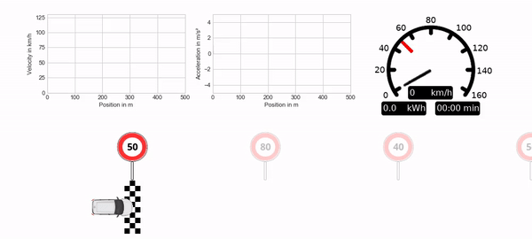
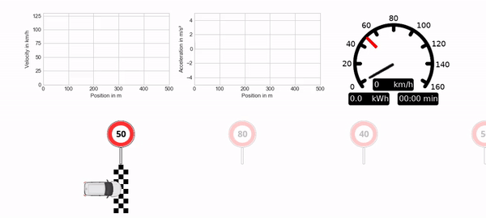

# gym-longicontrol

[](https://github.com/dynamik1703/gym_longicontrol/actions/workflows/ci.yml)

LongiControl is a Gymnasium environment for longitudinal control of an electric
vehicle. An agent controls acceleration on a one-dimensional track while
balancing travel speed, predicted energy use, jerk, and compliance with changing
speed limits.

The environment combines a data-derived BMW i3 power model with deterministic
or seeded stochastic tracks. It is intentionally compact enough for work on
multi-objective RL, Safe RL, and explainability while retaining physically
meaningful units and constraints. The environment was introduced in
[LongiControl: A Reinforcement Learning Environment for Longitudinal Vehicle
Control](https://doi.org/10.5220/0010305210301037).

## Installation

LongiControl requires Python 3.10 or newer.

```bash
python -m pip install .
```

The core installation is headless and depends only on Gymnasium and NumPy.
Install optional features explicitly:

```bash
python -m pip install ".[render]"  # visualization
python -m pip install ".[video]"   # video recording
python -m pip install ".[train]"   # bundled PyTorch SAC example
python -m pip install ".[dev]"     # tests, linting, and package builds
```

## Quick start

```python
import gymnasium as gym
import gym_longicontrol  # registers the environments

env = gym.make("gym_longicontrol:StochasticTrack-v1")
observation, info = env.reset(seed=42)

terminated = truncated = False
while not (terminated or truncated):
    action = env.action_space.sample()
    observation, reward, terminated, truncated, info = env.step(action)

print(info["position_m"], info["total_energy_kwh"])
env.close()
```

Available registered environments are:

- `DeterministicTrack-v1`: caller-defined speed-limit positions and values.
- `StochasticTrack-v1`: a new reproducible track is sampled at reset.

Both use a 1,000 m track, a 10 Hz simulation step, a 150 m sensor range, and a
registered 1,800-step time limit. Reach the finish to terminate; hit the time
limit to truncate.

### Deterministic track configuration

Positions are specified in kilometres and speed limits in kilometres per hour,
matching the original public API:

```python
env = gym.make(
    "gym_longicontrol:DeterministicTrack-v1",
    speed_limit_positions=[0.0, 0.25, 0.5, 0.75],
    speed_limits=[50, 80, 40, 50],
    reward_weights=[1.0, 0.5, 1.0, 1.0],
    energy_factor=1.0,
)
```

Configuration is validated when the environment is created. Invalid action
shapes, mismatched track arrays, missing initial limits, and out-of-range
`energy_factor` values fail with descriptive exceptions.

## Observation, action, and reward

The action is a one-element continuous array in `[-1, 1]`. It is mapped to a
velocity-dependent feasible acceleration using the vehicle's acceleration and
power limits.

The eight normalized observation features are, in order:

1. velocity;
2. previous acceleration;
3. current speed limit;
4. next speed limit;
5. second-next speed limit;
6. distance to the next speed limit;
7. distance to the second-next speed limit;
8. `energy_factor`, a policy context feature.

The scalar reward is the weighted sum of four signed components named
`forward`, `energy`, `jerk`, and `shock`. The individual values are available
under `info["reward_components"]`, so the training signal can be inspected without
reimplementing the reward function. These historical components, including
`shock`, are not the physical benchmark metrics below.

For compatibility with published experiments, `energy_factor` remains a context
feature and does not itself scale the energy reward. Change
`reward_weights[1]` to alter the energy contribution.

The info mapping supplies explicit-unit keys such as `position_m`,
`velocity_m_s`, `velocity_km_h`, `acceleration_m_s2`, `elapsed_time_s`, and
`total_energy_kwh`. Short keys used by version 0.0.1 remain as transitional
aliases.

## Task specification and evaluation

Operational requirements can be defined independently of reward design. The
canonical benchmark question is: **minimize net energy consumption while
completing the route within a time budget and respecting the speed limit**.
Reward is an algorithm/training signal; `EpisodeMetrics` are physical evaluation
quantities. Do not rank benchmark results by reward, or credit a stationary,
unfinished episode for its low energy use.

After the rollout in the quick start has ended (`terminated or truncated`):

```python
from gym_longicontrol.domain.metrics import EpisodeMetrics
from gym_longicontrol.domain.task import TaskSpecification, is_feasible

task = TaskSpecification(max_time_s=140.0, max_speed_violation_m_s=0.0)
metrics = EpisodeMetrics(**info["episode_metrics"])
print(is_feasible(metrics, task), metrics.energy_kwh)
```

Both dataclasses are immutable. `is_feasible` requires route completion,
`travel_time_s <= max_time_s` and maximum speed excess within the specified
tolerance. It ignores reward and energy; energy is minimized **among feasible
episodes** on comparable routes/tasks. Bounds are inclusive and comparisons use
the recorded floats exactly, without rounding or a hidden epsilon. Accumulated
simulation time may differ slightly from nominal decimal time at a boundary.

Metrics have these definitions:

- `completed`: the route finish has been reached, not merely a time limit.
- `travel_time_s`: simulation time elapsed since reset, including on timeouts.
- `energy_kwh`: signed cumulative net energy from the existing power model;
  regeneration is retained. This is predicted energy, not a real-world measurement.
- `speed_violation_count`: number of contiguous runs of samples above the limit.
  Equality or falling below the limit ends an event. Task tolerance does not
  change this physical count.
- `max_speed_violation_m_s`: maximum of `max(0, velocity_m_s - speed_limit_m_s)`.
- `integrated_speed_violation_m`: sum of speed excess times `dt_s`, in
  **metres** (m/s × s).

Excess is sampled at each integration step's **end**, using the limit at the
updated position. The integral uses that sample over the full step (a
right-endpoint approximation). It does not reconstruct within-step crossings;
even the finishing step retains the existing full-step integration. Reset adds
no time interval or violation event. `info` exposes current `speed_excess_m_s`,
the three accumulated violation metrics above, and a fresh plain-dict
`episode_metrics` snapshot on every reset/step. Read the final step's snapshot
before resetting; it is available even when an outer Gymnasium `TimeLimit`
truncates the episode. `env.unwrapped.episode_metrics` returns the immutable
snapshot directly. Partial snapshots report completion as false until the route
ends. Existing `info` keys are retained.

The task is **not** passed into v1 dynamics: it does not alter observations,
actions, rewards, environment IDs or termination, and it does not set Gymnasium's
time limit. A 140-second requirement therefore does not stop the simulation at
140 seconds. Evaluation is pure and can rescore the same measurements against
different requirements without knowing which algorithm generated the trajectory.

This small layer supports future comparisons of scalar RL, MORL, constrained RL
and requirement-/goal-conditioned RL. It adds no new RL algorithm, constrained
training method or goal-conditioned observation space, and is not yet a full
benchmark protocol or safety guarantee.

## Scalar SAC benchmark

The first repository benchmark fixes one stochastic-track evaluation set and a
140-second, zero-speed-excess task, then varies a compact family of scalar SAC
training rewards. It reports requirement satisfaction and physical episode
metrics rather than mean reward, retains raw per-track results, and includes
headless diagnostic plots. The historical `-v1` reward is not changed.

See [the benchmark protocol](benchmarks/scalar_sac/README.md) for the exact
reward formula, seed split, eight-point reward grid, empirical time-budget
calibration, smoke command, and result format. This is the scalar baseline only;
the planned MORL, constrained-RL, and requirement-conditioned comparisons are
not implemented yet.

The [first 140-second experiment report](benchmarks/scalar_sac/RESULTS.md)
contains the complete 24-run outcome, reference-controller anchors, paired
track-level energy analysis, failure regimes, and the decision gate for the
next research stage.

The subsequent [Scalar V2 baseline-hardening report](benchmarks/scalar_sac/RESULTS_V2.md)
documents analytical reward redesign, 100k/300k learning curves, a predefined
acceptance gate, a new validation/final-test split, and the remaining training
instability. It preserves V1 as a separate result and does not add another RL
paradigm.

## Stable-Baselines3 scalar baseline

The [controlled SB3 report](benchmarks/scalar_sb3/RESULTS.md) compares current
Stable-Baselines3 SAC and PPO with the same V2-B Balanced reward, physical task,
training seeds, 300k interaction budget, and reward-independent evaluator.
Install the optional tooling with:

```bash
python -m pip install -e ".[benchmark]"
```

Neither trainer passes the frozen strong-baseline gate: SAC reaches 5/27
feasible validation episodes with a 4/9 seed range, while PPO reaches 0/27 and
learns standstill on every seed. This triggers the documented
[stop decision](benchmarks/agent_reward/STOP_REPORT.md) for the proposed
human-designed versus agent-designed reward study. No agent reward experiment
or new RL paradigm has been started, and final-paper seeds 4000–4017 remain
untouched.

## Scalar credit-assignment diagnostic

The subsequent [preregistered credit-assignment study](benchmarks/credit_assignment/RESULTS.md)
tests whether the weak scalar result is mainly explained by per-decision gamma
or the 10-Hz policy-decision horizon. Four SB3 SAC conditions vary only gamma
(0.99/0.999) and action repeat (1/5), with exactly 300k native simulator
transitions per seed. Repeat 5 keeps physics and metrics at 10 Hz while the
policy acts at 2 Hz.

Action repeat alone increases final validation feasibility from 5/27 to 9/27,
but remains strongly seed-sensitive and introduces speed violations. Higher
gamma reaches 0/27 alone and 1/27 with repeat. None passes the preregistered
materiality or robustness gate, so no further scalar tuning is started. The
sealed 4000–4017 paper-test tracks remain untouched.

## Explicit constrained-RL benchmark

The next [preregistered constrained study](benchmarks/constrained_rl/RESULTS.md)
uses FSRL SAC-Lagrangian with physical net energy as the sole objective and two
separate costs: integrated speed excess and terminal completion/deadline failure.
The simulator, observations, native 10-Hz action semantics, and external
`EpisodeMetrics` evaluator remain unchanged.

This first formulation reaches 0/27 feasible validation episodes on three
training seeds: every deterministic policy stands still, while all 27 episodes
respect the speed limit. It is classified as gate D, not as a successful safe
policy. Explicit constraints do not yet provide a credible paper baseline; the
sparse completion/deadline constraint representation must be repaired before
progressing to requirement-conditioned control. Sealed tracks 4000–4017 remain
untouched.

The separate [Constrained RL V2 study](benchmarks/constrained_rl_v2/RESULTS.md)
replaces only that terminal task cost with a dense, physical deadline-deficit
integral. It changes standstill into 27/27 on-time completions and raises final
validation RSR to 21/27, versus 0/27 for Constrained V1 and 5/27 for frozen
scalar SB3 SAC. Six completed episodes still violate speed limits, so the
preregistered result is gate B: deadline credit is learnable, but the
interaction of the two constraints is not yet robust enough for a credible
paper baseline. No requirement-conditioned method is implemented automatically,
and sealed tracks 4000–4017 remain untouched.

The follow-up [V2 speed-failure diagnosis](benchmarks/constrained_rl_v21/RESULTS.md)
replays all 27 frozen final policies without retraining. Four failures are tiny
constant-section boundary-tracking errors from seed 29; two are meaningful late
braking at downward limit changes from seed 47. Every violating step has zero
deadline deficit and at least 20 s optimistic slack, so deadline pressure does
not explain the failures. Because a margin-only and an anticipatory-braking-only
intervention address different subsets, the formal outcome is gate F: no V2.1
training, freeze Constrained RL, and preregister Requirement-Conditioned RL
separately.

## Requirement-conditioned RL benchmark

The next separately preregistered study asks whether one unchanged-capacity
FSRL SACLag policy can take an episode-specific operational deadline as input.
A benchmark-only wrapper leaves the public eight-dimensional observation intact
and appends normalized absolute deadline and elapsed time. Physics-selected
training margins are 20/40/60 seconds beyond each route's optimistic minimum;
30/50 seconds are held out for zero-shot interpolation.

At the fixed 300k-transition budget, the controller changes travel time strongly
and interpolates directionally, but only 48/135 primary Validation episodes are
feasible. Energy does not fall systematically with looser deadlines, two of
three policy seeds are weak, and the canonical 140-s result is 12/27 versus
frozen Constrained V2's 21/27. The preregistered outcome is **Gate D**: useful
requirement sensitivity exists, but tight requirements fail systematically and
the method is not yet a robust requirement-conditioned controller. See
[`benchmarks/requirement_conditioned/RESULTS.md`](benchmarks/requirement_conditioned/RESULTS.md)
for the protocol, full matrix, trajectories, plots, and collector-sampling
amendment. No subsequent method is implemented automatically.

## Binary success reward benchmark

The next [preregistered Binary Success Reward study](benchmarks/binary_reward/RESULTS.md)
asks whether the frozen SB3 SAC learner can solve the same canonical task from
only a terminal success bit. Its benchmark-only wrapper returns zero on every
intermediate or failed transition and one only when the existing external
`is_feasible` evaluator accepts the completed episode. It adds no shaping,
partial reward, HER, relabeling, constraint signal or conditioned observation.

The answer under the fixed 300k-per-seed protocol is **Gate D**: no positive
reward occurs in 604 completed training episodes, Validation RSR remains zero
at every checkpoint, and the final policies reach 0/27 feasible episodes. Early
policies complete but violate speed limits; by 100k all seeds have collapsed to
speed-compliant non-completion and remain there. This controlled failure leaves
the physical task and evaluator unchanged while showing that a success/failure
specification alone does not provide enough learning signal for standard SAC in
the tested budget. Sealed tracks 4000--4017 remain untouched.

## LLM reward-engineering harness

The next arm asks whether a coding LLM can discover a useful dense scalar reward
under a fixed, small Eureka-style search budget while retaining the frozen SB3
SAC learner and physical evaluator. [Phase 1](benchmarks/llm_reward/README.md)
implements and preregisters the isolated harness only: 5+3+3 candidate slots,
50k-step Development-only screening, a typed physical signal whitelist,
static/runtime candidate checks, sanitized reward reflection, lexicographic
task-first ranking, deterministic parent selection, auditable history, and a
winner hash gate before final evaluation.

Phase 1 contains no generated reward, no candidate training, no LLM API call and
no Validation or paper-final evaluation. `search_history.json` remains
`NOT_STARTED`, `generations/` is empty, and a 191-file checksum manifest protects
all preceding studies plus the task/evaluation layer and public environments.
The actual reward-design search must occur in a fresh session using only the
sanitized generation package described by the frozen protocol.

## Model-based constrained RL preparation

The next prepared arm compares [learned vehicle dynamics with known exogenous
track maps against the exact physics model](benchmarks/model_based_rl/README.md).
Both conditions retain the Constrained RL V2 task, costs, SACLag learner, real
interaction budget, one-step imagination schedule and actor-only evaluation.
The preparation includes a primary-source audit, model/state boundary, physics
parity, probabilistic ensemble, diagnostics, checkpoint/run protection and a
frozen six-policy protocol. No MBRL main policy, Validation or paper-test run
has started; all execution authorization flags remain false.

## Rendering

Install the `render` extra and select the mode while creating the environment:

```python
env = gym.make(
    "gym_longicontrol:DeterministicTrack-v1",
    render_mode="rgb_array",  # or "human"
)
observation, info = env.reset(seed=2)
frame = env.render()
```

No rendering package is imported during ordinary headless training.

## PyTorch SAC example

Run training from a repository checkout; the wheel intentionally installs only
the environment. The trainer is import-safe and uses the Gymnasium lifecycle:

```bash
python -m training \
  --env_id DeterministicTrack-v1 \
  --save_id 1 \
  --num_epochs 100 \
  --num_steps_per_epoch 1000
```

Resume a run or visualize a checkpoint with:

```bash
python -m training --env_id DeterministicTrack-v1 --load_id 1
python -m training --env_id DeterministicTrack-v1 --load_id 1 --visualize
python -m training --env_id DeterministicTrack-v1 --load_id 1 --visualize --record
```

Use the same environment, model and replay configuration when resuming.
Training outputs are saved under `rl/pytorch/out/<env>/SAC_id<id>/` by default;
use `--output_dir` to select another location. Checkpoints contain optimizer,
target-network, replay and RNG state; run configuration and histories are JSON.
Inspect a history with `python -m training.monitor path/to/seed2.json`.

The former `python rl/pytorch/main.py ...` entry point remains as a compatibility
wrapper. TensorFlow 1 DDPG and its SHAP notebook are retained only as historical
research artifacts and are not installed or tested.

## Development

```bash
python -m pip install -e ".[dev,render,video,train,legacy]"
python -m pytest
python -m ruff check .
python -m build
```

CI tests supported Python versions, builds both wheel and source distribution,
installs the wheel into a clean environment, and verifies that the vehicle and
rendering assets were packaged. Gymnasium's environment checker is part of the
test suite.

See [MIGRATION.md](MIGRATION.md) when updating code written for version 0.0.1.

## Model provenance

The bundled power estimator was originally trained from Argonne National
Laboratory [Downloadable Dynamometer Database](https://www.anl.gov/es/downloadable-dynamometer-database)
data. Version 1.0 stores only its fitted layers in a portable NumPy archive;
runtime code no longer imports scikit-learn or unpickles an estimator. Adjacent
JSON metadata records the source artifact hash, original sklearn version,
feature order, units, and layer shapes. Maintainers can reproduce the one-time
conversion with `tools/convert_legacy_power_model.py`.

## Citation

```bibtex
@conference{icaart21,
  author={Dohmen, Jan and Liessner, Roman and Friebel, Christoph and Bäker, Bernard},
  title={LongiControl: A Reinforcement Learning Environment for Longitudinal Vehicle Control},
  booktitle={Proceedings of the 13th International Conference on Agents and Artificial Intelligence - Volume 2: ICAART,},
  year={2021},
  pages={1030-1037},
  publisher={SciTePress},
  organization={INSTICC},
  doi={10.5220/0010305210301037},
  isbn={978-989-758-484-8},
}
```

## Original visualizations

<p align="center">
  
  
  
</p>
