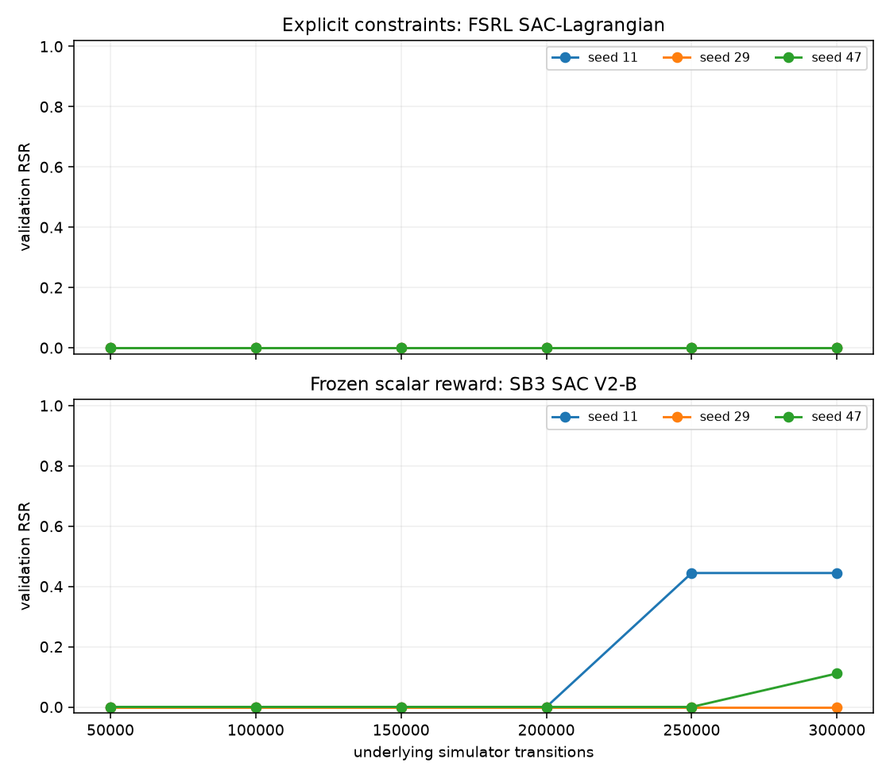
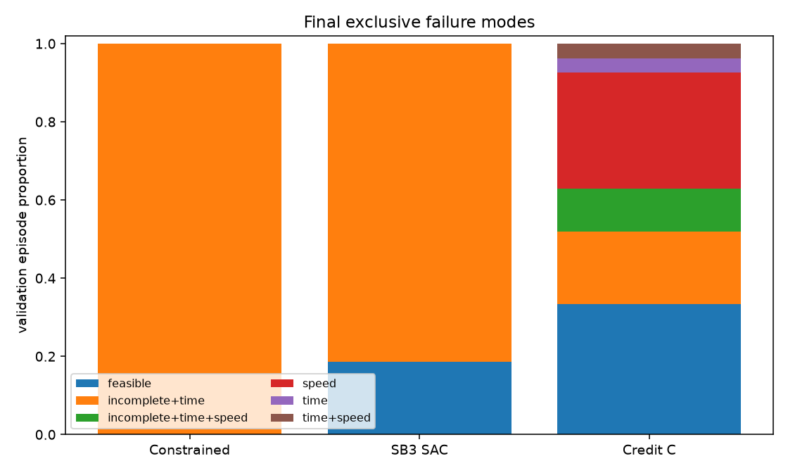
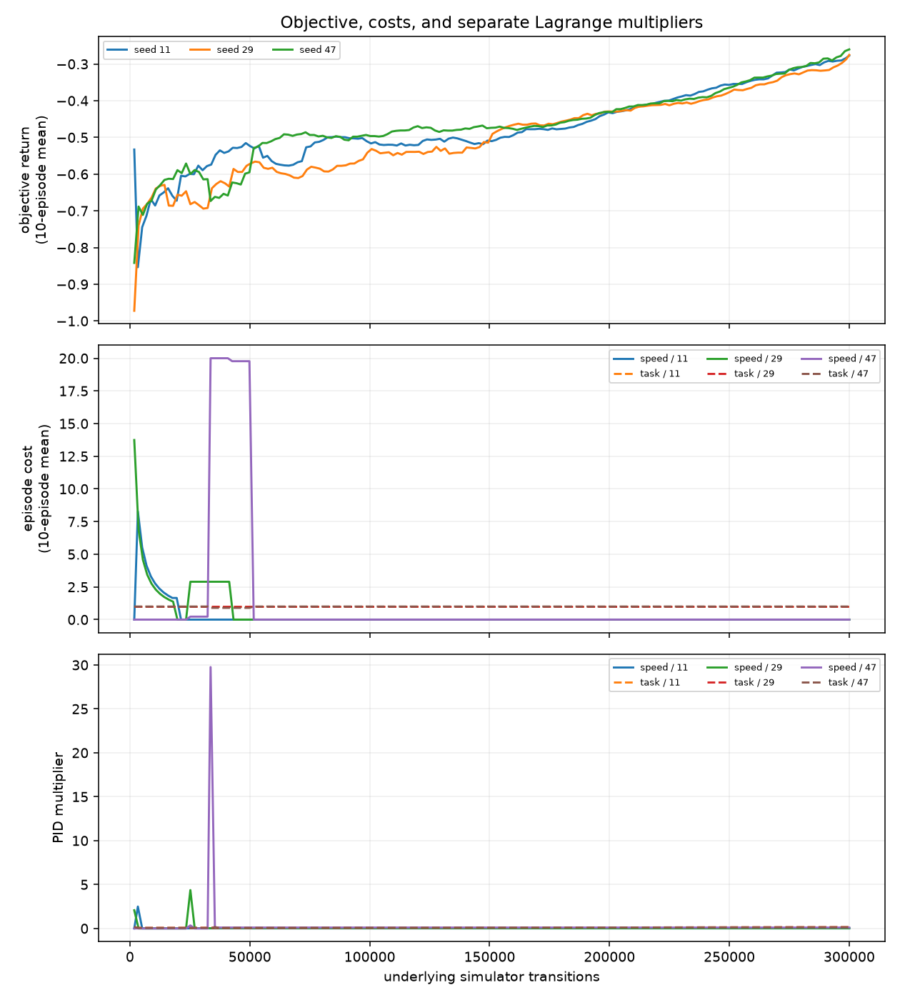
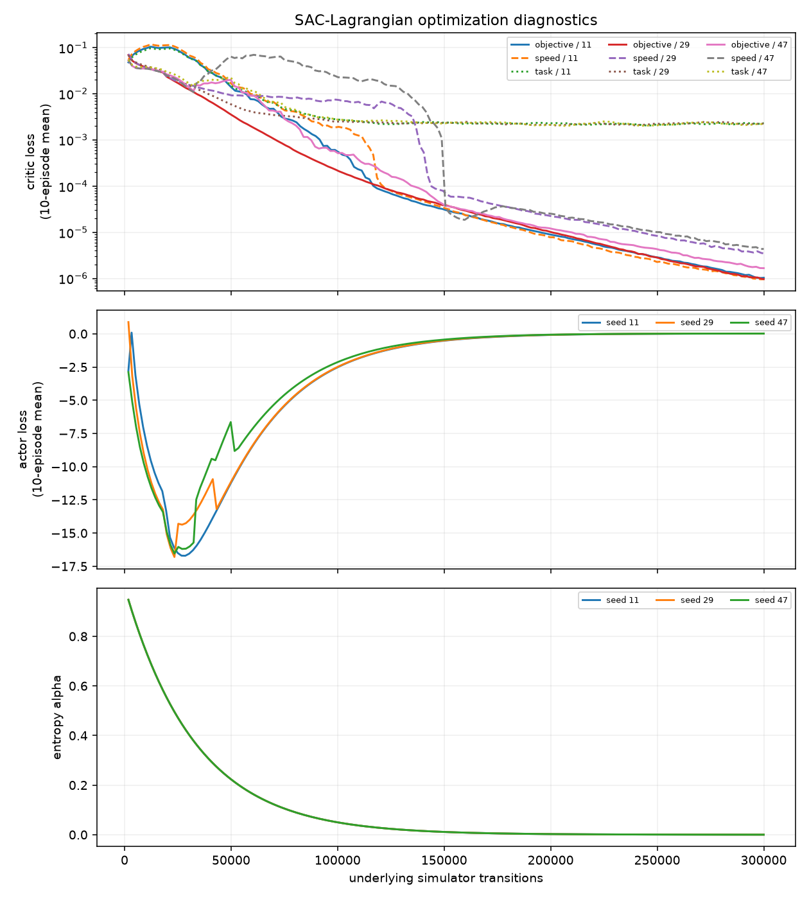
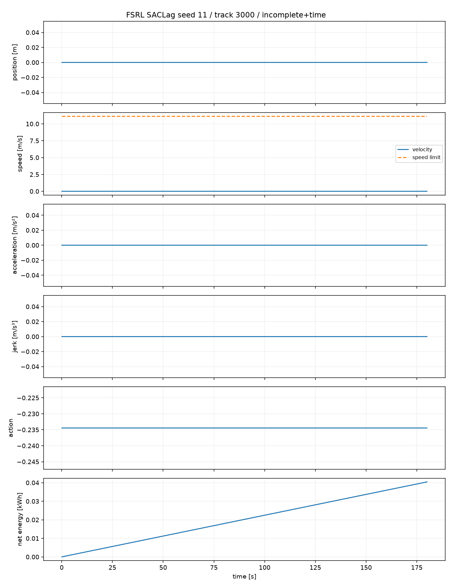
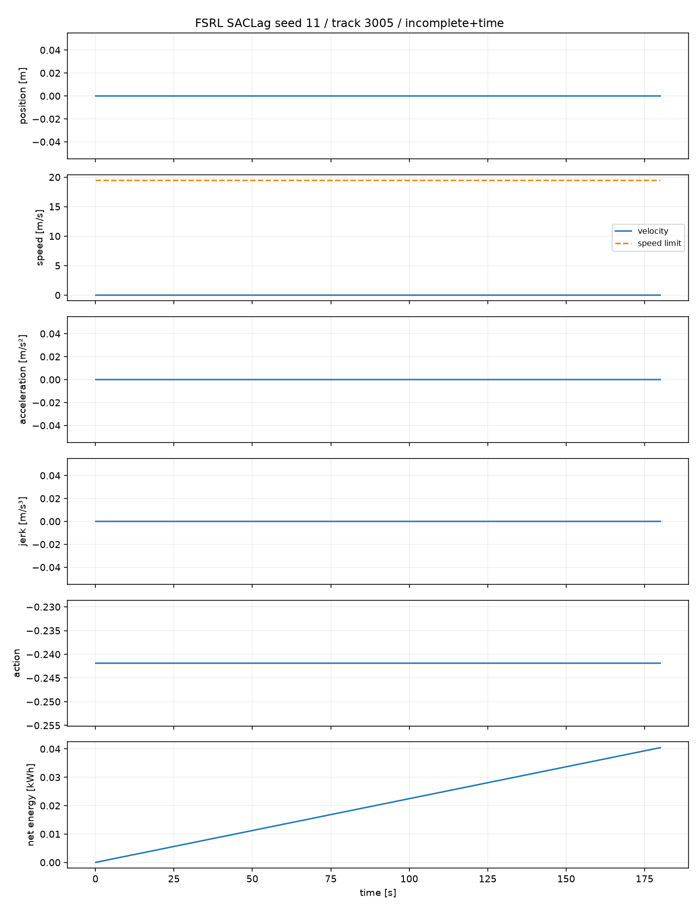
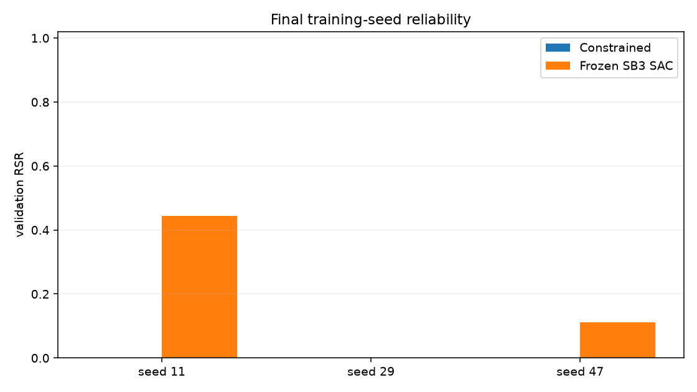

# Explicit constrained-RL benchmark: results

## Outcome

The preregistered outcome is **case D: the constraints are satisfied primarily
through standstill**. FSRL SAC-Lagrangian reaches 0/27 feasible validation
episodes and 0/27 completions at 300k. All 27 episodes respect the speed limit,
but every deterministic policy remains at position 0 for the full 180 s time
limit. This is worse than the frozen SB3 SAC V2-B result of 5/27.

Explicitly separating energy from the requirements therefore does **not**
materially improve learning in this first formulation. It is not yet a credible
constrained baseline for the later Rewards-vs-Requirements comparison. The
result diagnoses the sparse binary completion/deadline constraint as inadequate;
it does not establish that constrained RL in general is inferior to scalar RL.

## Exact CMDP formulation

The simulator, observation, action, native 0.1 s integration step, termination,
and reward-independent evaluator remain unchanged. `action_repeat` is 1.

At each simulator step the training objective is

```text
reward = -signed_step_energy_kwh / 0.25 kWh
```

There is no progress bonus, time penalty, speed penalty, or completion bonus.
The fixed energy scale has no behavioral meaning. Regeneration is signed and can
therefore produce positive objective reward.

Two cost signals have separate critics and PID-Lagrange multipliers, in frozen
order:

1. `speed_integral_m = max(0, velocity_m_s - speed_limit_m_s) * dt_s`,
   with episodic limit 0 m;
2. `task_failure = 1` only at episode termination/truncation unless the route is
   complete within 140 s, otherwise 0, with expected episodic limit 0.

The speed definition is the existing right-endpoint `EpisodeMetrics` integral.
Speed is not folded into the task-failure cost. A final artificial truncation at
the exact 300k training boundary counts as task failure when the route is
incomplete.

## Library and Lagrangian configuration

The learner is FSRL 0.1.0 SAC-Lagrangian at Git revision
`e056fc9498d5d037869533da7cf976acf462f918`, using Tianshou 0.5.1. It was chosen
because it provides continuous Box-action SAC-Lagrangian, one cost critic per
constraint, and independent PID multipliers.

The pinned FSRL revision constructs the correct multiple critics and
multipliers, but its n-step helper does not split vector cost columns and its
collector reduces the returned episodic vector to a scalar. The local adapter
only splits the two stored columns and restores the wrapper's exact undiscounted
episode totals. It does not change FSRL's SAC, target construction, losses, PID
rule, or actor optimization.

Frozen library-default settings are:

| Setting | Value |
|---|---:|
| Actor / critic learning rate | 5e-4 / 1e-3 |
| Network | 128, 128 |
| Replay / batch | 100,000 / 256 |
| Gamma / tau / n-step | 0.99 / 0.05 / 2 |
| Updates per transition | 0.1 |
| Automatic alpha / alpha LR | yes / 3e-4 |
| Initial effective alpha | 1.0 |
| PID `(Kp, Ki, Kd)` | (0.05, 0.0005, 0.1) |
| Initial multipliers | 0 / 0 |
| Cost limits | 0 m / 0 failures |
| Lagrangian rescaling | enabled |

FSRL has no separate multiplier learning-rate parameter; `Ki=0.0005` is the
integral update coefficient. No Lagrange sweep or numerical stabilization was
performed.

## Protocol and provenance

`PROTOCOL.md` and `canonical.json` were frozen before main training. Training
seeds are 11, 29, and 47. Development tracks are 2000--2008 and validation
tracks are 3000--3008. Historical tracks 1000--1008 were not used. Sealed tracks
4000--4017 were not generated, evaluated, inspected, or plotted.

Each seed received exactly 300,000 native transitions and 30,000 gradient
updates. Intermediate evaluation occurred after the first complete episode
crossing each target; the final budget wrapper landed exactly on 300k.

| Target | Seed 11 actual | Seed 29 actual | Seed 47 actual |
|---:|---:|---:|---:|
| 50k | 50,106 | 50,400 | 51,633 |
| 100k | 100,506 | 100,800 | 100,233 |
| 150k | 150,906 | 151,200 | 150,633 |
| 200k | 201,306 | 201,600 | 201,033 |
| 250k | 251,706 | 250,200 | 251,433 |
| 300k | 300,000 | 300,000 | 300,000 |

There are 36 validated result files: 3 seeds x 6 checkpoints x 2 splits.
Configuration SHA-256:
`0c1f3fd23bb84a69be8e1b94ff284734bbedd7b9d5659920935c736d941a8384`.
Training-only wall time was about 468 s per seed on the recorded Apple-arm64
host; concurrent wall-clock time is not used as a scientific outcome.

## External physical evaluation

Development and validation produce the same qualitative result at every
checkpoint: zero completion and RSR, with perfect speed compliance.

| Validation target | Seed RSR (11 / 29 / 47) | Completion | Time compliant | Speed compliant |
|---:|---|---:|---:|---:|
| 50k | 0/9 / 0/9 / 0/9 | 0/27 | 0/27 | 27/27 |
| 100k | 0/9 / 0/9 / 0/9 | 0/27 | 0/27 | 27/27 |
| 150k | 0/9 / 0/9 / 0/9 | 0/27 | 0/27 | 27/27 |
| 200k | 0/9 / 0/9 / 0/9 | 0/27 | 0/27 | 27/27 |
| 250k | 0/9 / 0/9 / 0/9 | 0/27 | 0/27 | 27/27 |
| 300k | 0/9 / 0/9 / 0/9 | 0/27 | 0/27 | 27/27 |

All final failures are exclusively `incomplete+time`. Final mean travel time is
180 s, maximum and integrated speed violation are exactly zero, and RSR range is
zero only because every independent seed fails identically. The apparent seed
stability must not be described as robustness.





## Constrained-learning diagnostics

The optimizer remains finite. This rules out decision E under the preregistered
thresholds, but does not imply that the policy objective is well conditioned.

| Seed | Max speed multiplier | Final speed multiplier | Final task multiplier | Max absolute critic loss | Final alpha |
|---:|---:|---:|---:|---:|---:|
| 11 | 2.493 | 0.0083 | 0.1335 | 0.445 | 1.294e-4 |
| 29 | 4.367 | 0.0214 | 0.1335 | 0.209 | 1.294e-4 |
| 47 | 29.760 | 0.1000 | 0.1330 | 0.191 | 1.294e-4 |

Early stochastic training produces speed cost and makes the speed multipliers
react, especially for seed 47. By the reported checkpoints, the latest training
episodes have zero speed cost while task-failure cost remains 1. The task
multiplier rises from about 0.064 at 50k to about 0.133 at 300k, but never induces
completion. Objective, speed-cost, and task-cost critics remain finite; final
objective/speed critic losses are around 1e-6, while task-cost critic losses are
around 0.002. Alpha falls from 1.0 initially to about 1.3e-4.

This pattern is consistent with a learnable zero-action energy solution and a
terminal task signal that is too sparse and too delayed to change the actor. It
is a diagnosis from the observed signals, not proof that the multiplier values
or shared gamma are the unique cause.





## Representative trajectories

The preregistered median-final-RSR rule selects seed 11; all seeds tie at zero,
so the lower-seed tie break applies. Tracks 3000 and 3005 were replayed from the
saved final checkpoint at native 10 Hz.

| Track | Behavior | Final position | Velocity range | Constant action | Energy |
|---:|---|---:|---:|---:|---:|
| 3000 | standstill | 0 m | 0--0 m/s | -0.2344 | 0.04044 kWh |
| 3005 | standstill | 0 m | 0--0 m/s | -0.2419 | 0.04044 kWh |

The negative deterministic action requests braking at rest. Position, velocity,
acceleration, and jerk remain zero for 180 s. Low energy is a failed-policy
artifact and is not efficiency.





## Energy after feasibility

There are no feasible constrained episodes, so mean/median feasible energy,
per-track paired energy, and ratios to the fast or conservative controllers are
undefined. No energy ranking is made. For context only, the fast compliant
reference is 9/9 feasible with mean feasible energy 0.1980 kWh; the conservative
reference is 7/9 feasible with mean feasible energy 0.1969 kWh.

## Frozen scalar comparisons

| Frozen method | Final validation RSR | Completion | Speed compliance |
|---|---:|---:|---:|
| Constrained FSRL SACLag | 0/27 | 0/27 | 27/27 |
| SB3 SAC V2-B | 5/27 | 5/27 | 27/27 |
| Credit condition C (repeat 5) | 9/27 | 19/27 | 15/27 |
| Historical custom SAC V2-B | 2/27 validation mean | not reinterpreted | not reinterpreted |

The constrained mean-RSR change relative to the frozen primary SB3 SAC baseline
is -5/27 (-0.185), whereas material improvement required at least +6/27 and an
improvement in two training seeds. No constrained seed improves its paired
scalar seed. The constrained policy avoids the speed exploitation seen in
Credit C only by never moving.



## Three distinct levels of meaning

1. **Training formulation:** FSRL optimizes discounted expected reward/cost
   critics and updates PID multipliers from undiscounted collected episode costs.
2. **Episode requirement:** one trajectory must finish within 140 s with no
   speed excess. An expected zero-cost target does not guarantee this.
3. **Paper evaluation:** reward-independent RSR counts how often the exact
   individual-trajectory requirements hold. It is zero here regardless of finite
   optimizer diagnostics or perfect speed compliance.

Conflating these levels would incorrectly call standstill safe or efficient.

## Decision and recommendation

The predefined order maps the outcome to **D**, before case C: pooled completion
is at most 1/3 (it is zero) while speed compliance is at least 8/9 (it is 27/27).
The binary terminal completion/deadline constraint is therefore inadequate.

Do not proceed directly to requirement-conditioned RL, do not run 1M steps, and
do not tune multiplier grids. The next bounded study should first replace only
the task-failure training representation with a physically interpretable signal
that gives the actor completion/deadline credit, while keeping the energy
objective, speed cost, simulator, evaluator, seeds, and 10-Hz action semantics
fixed. A promising candidate to preregister on Development is an explicit
episode-duration/deadline cost whose accumulation stops on route completion,
possibly retaining a separate incomplete terminal indicator. Its expected-cost
and discount semantics must be derived before validation; it must not become an
arbitrary weighted scalar reward.

Most importantly:

> In this first explicit formulation, separating energy from completion, time,
> and speed requirements does not materially improve learning. The learner finds
> the energy-minimizing standstill solution on every seed.

> Constrained RL is not yet a credible LongiControl baseline for the paper. The
> task-constraint representation must be repaired and preregistered before that
> comparison can be made.

## Verification

- `python -m pytest`: 169 passed.
- `python -m ruff check .`: passed.
- `git diff --check`: passed.
- Wheel and source distribution: built successfully with `python -m build
  --no-isolation`; the generated source distribution includes code, protocol,
  compact results, tests, and all seven intentional plots.
- All 36 raw result files contain only development seeds 2000--2008 and
  validation seeds 3000--3008; final simulator counts are 300,000 for all three
  training seeds.

The first isolated `python -m build` attempt failed before project build because
the configured corporate package-index hostname could not be resolved. After
installing the missing `wheel` build tool into ignored `runs/build-deps` from
PyPI, the offline no-isolation build succeeded. This was an infrastructure
failure, not a test or package-content failure.

## Reproduction artifacts

- [`PROTOCOL.md`](PROTOCOL.md): frozen formulation and decision rules.
- [`canonical.json`](canonical.json): validated machine configuration.
- [`results.json`](results.json): checkpoint-, seed-, comparison-, energy-, and
  decision-level machine summary.
- [`plot_results.py`](plot_results.py) and [`plots/`](plots/): deterministic
  outcome, optimizer, and native-step trajectory figures.
- `runs/constrained-rl-20260927/`: ignored checkpoints, 36 episode-level results,
  full training diagnostics, analysis, and native-step trajectory data.
