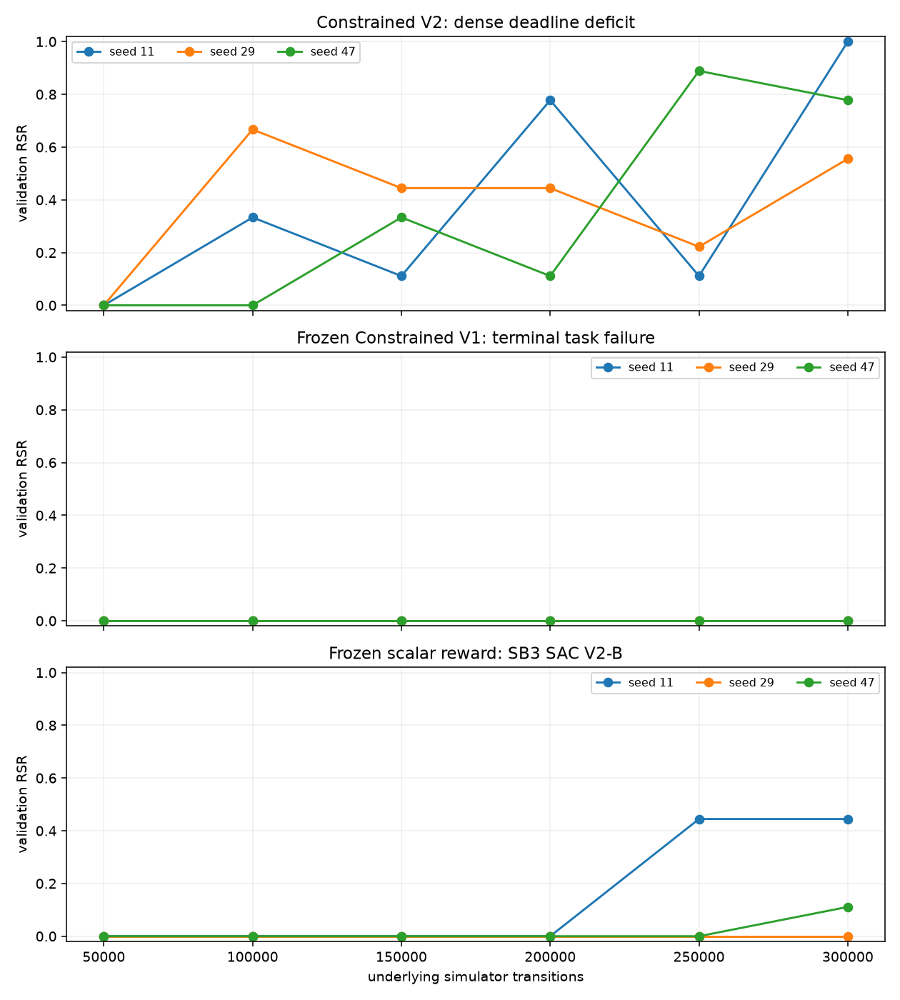
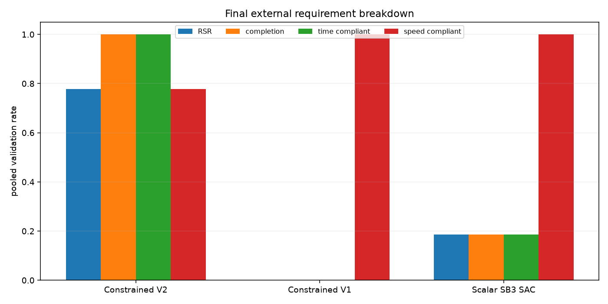
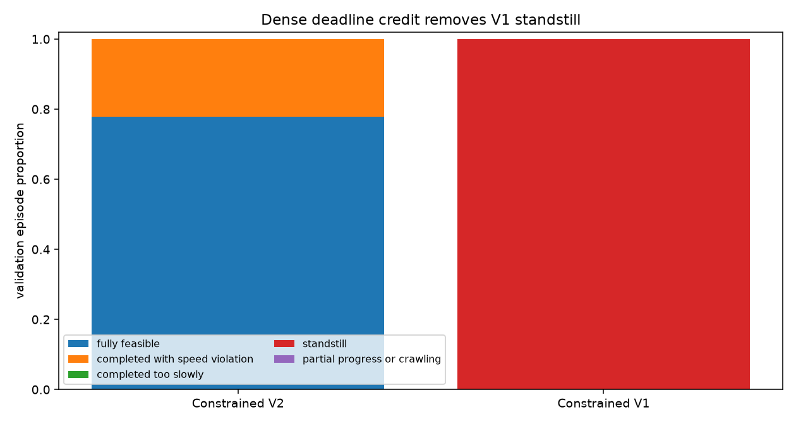
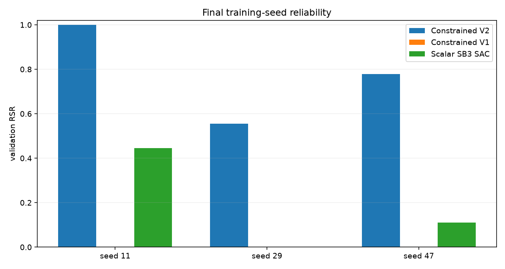
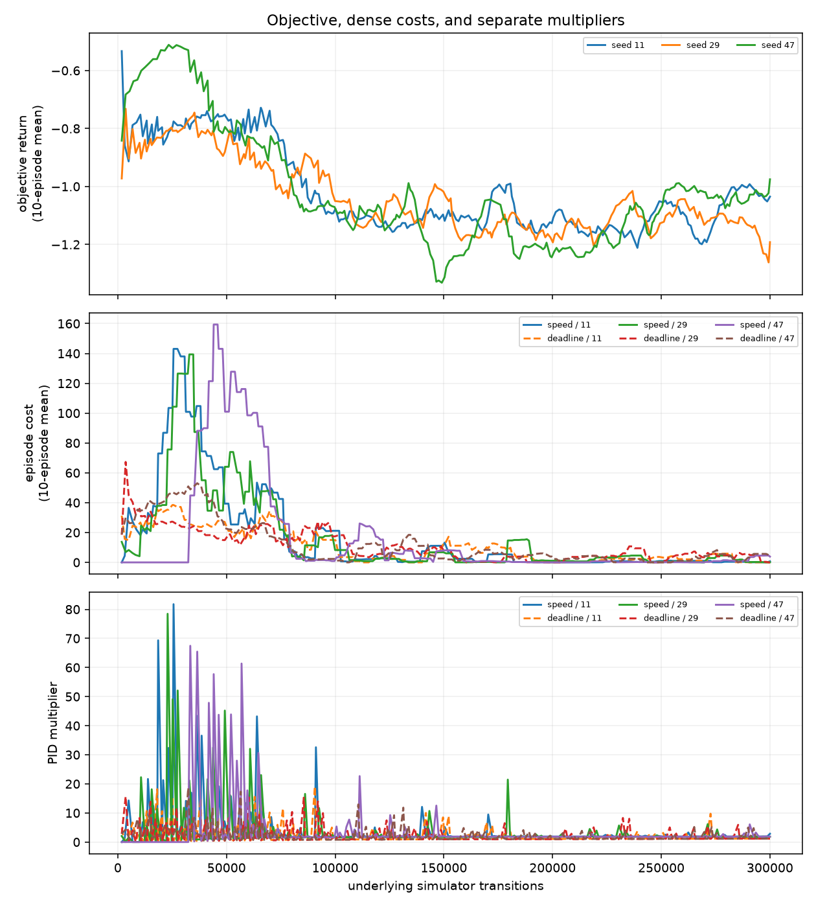
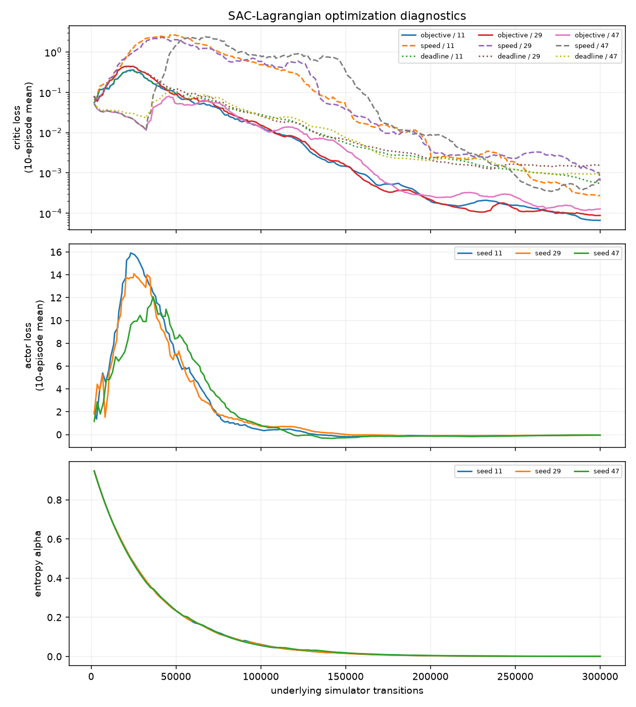
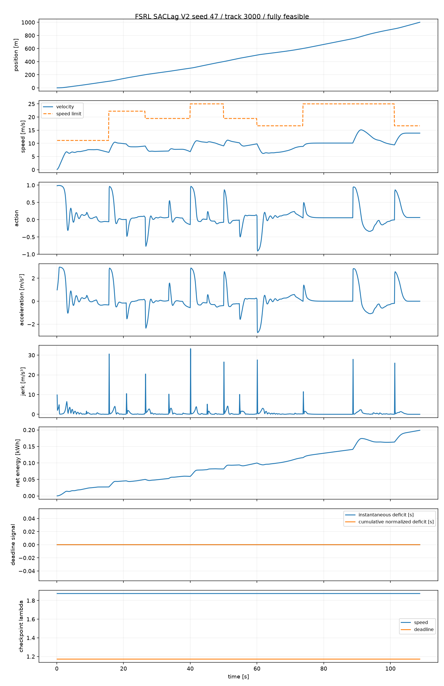
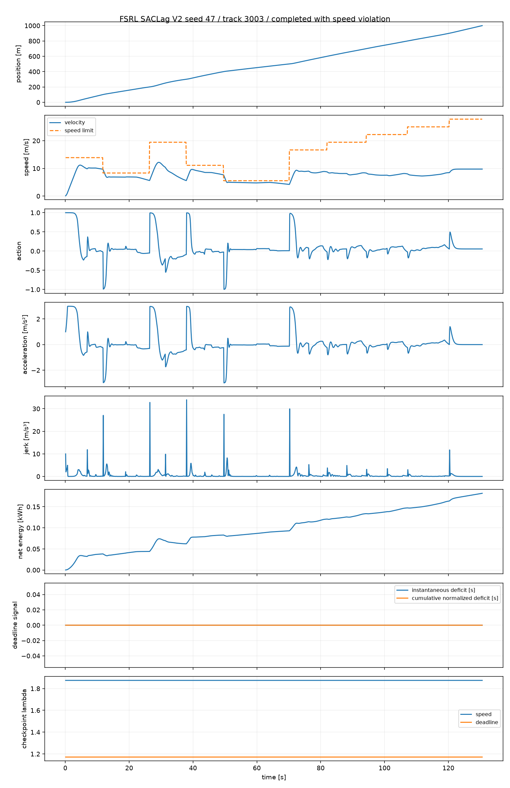

# Constrained RL V2: dense deadline credit

## Outcome

The preregistered result is **Decision Gate B: completion becomes learnable, but speed
violations rise**.

At 300k simulator transitions per seed, V2 completes all 27 Validation episodes within
140 s and achieves 21/27 externally feasible episodes. The seed RSRs are 9/9, 5/9, and
7/9 for seeds 11, 29, and 47. The remaining six failures are completed trajectories
with speed violations; there is no standstill, crawling, incomplete route, or late
completion at the final checkpoint.

This is a material change from frozen Constrained V1, which produced 0/27 completion,
0/27 RSR, and 27/27 standstill. It strongly supports the registered diagnosis that the
delayed binary task signal was the primary cause of the V1 standstill failure under this
fixed SACLag setup. It does not prove that delayed credit was the only V1 limitation.

V2 is nevertheless **not yet a credible robust constrained baseline** under the frozen
criterion: pooled speed compliance is 21/27, below the required 24/27, and final seed
RSR spans 5/9 to 9/9. Dense task credit makes the formulation viable and learnable, but
the interaction of speed and deadline constraints remains insufficiently reliable.





## V1 failure and the single V2 intervention

Frozen V1 used energy as the objective, the physical speed integral as the first cost,
and a binary task-failure cost only at episode termination. Its policy learned the
lowest-energy, zero-speed solution before the task critic could provide useful temporal
completion credit.

V2 changes only the second cost. For position `x`, define the optimistic remaining time
under the full piecewise-constant speed-limit profile:

```text
T_min(x) = integral from x to route end of dx / speed_limit(x)

slack_s   = 140 s - elapsed_time_s - T_min(x)
deficit_s = max(0, -slack_s)

deadline_deficit_integral_t =
    dt_s * deficit_s / 140 s
```

The cumulative undiscounted cost is the area under fractional negative deadline slack,
with units of seconds and episodic limit zero. The speed-limit integration handles
varying track limits and deliberately ignores acceleration, braking, comfort, and
energy, so `T_min` is an optimistic physical lower bound rather than a target
trajectory. All Development and Validation tracks start inside the envelope.

There is no V1-style terminal task-failure cost. An incomplete episode necessarily
falls behind the envelope after the 140 s deadline and accumulates positive cost before
the 180 s truncation. Completion after 140 s also produces positive cost. A trajectory
that temporarily leaves the envelope and later recovers retains positive internal cost;
the proxy is therefore conservative and is not equivalent to the external hard
requirement.

The other signals are exact V1 reuse:

```text
objective_t = -signed_step_energy_kwh / 0.25 kWh

speed_integral_t =
    max(0, velocity_m_s - speed_limit_m_s) * dt_s
```

There is no progress reward, completion reward, objective time penalty, objective speed
penalty, or terminal bonus.

## FSRL discount semantics and rejected raw-time cost

Inspection of the pinned FSRL source established four different quantities:

1. the collector's episodic reward is the undiscounted sum of step rewards;
2. the LongiControl adapter reconstructs each undiscounted episodic cost sum;
3. reward and all cost critics use the same two-step target and `gamma=0.99`;
4. once per collected episode, PID-Lagrange compares the undiscounted cost sums with
   the physical limits, while the actor receives gradients from discounted soft cost
   critics.

The pinned `SACLagrangian` also subtracts the entropy term in every target critic,
including the cost critics. V2 does not modify this implementation.

A raw per-step `time_cost=0.1 s` was rejected before training because its discounted
critic value is

```text
C(T) = 0.1 * (1 - 0.99^(T / 0.1)) / (1 - 0.99).
```

| Physical duration | Discounted cost |
|---:|---:|
| 100 s | 9.999568287526 |
| 120 s | 9.999942159303 |
| 140 s | 9.999992250522 |
| 160 s | 9.999998961727 |
| 180 s | 9.999999860893 |

The critic gap from 140 to 160 s is only `6.7112e-6`; 160 to 180 s differs by only
`8.9917e-7`. A nominal critic limit of 140 would be dimensionally wrong, while an
undiscounted PID limit of 140 would still leave the actor with an almost saturated,
locally action-independent cost critic. The preregistered stop gate therefore selected
the deadline-deficit formulation, not a sweep of alternative signals.

## Frozen protocol and execution

The canonical configuration SHA-256 is
`89d7142cc84ba60d98075313220b331b60c2c41997b6c65b11adeb1b08712060`.

- FSRL SACLag revision: `e056fc9498d5d037869533da7cf976acf462f918`.
- Tianshou: 0.5.1.
- Training seeds: 11, 29, 47.
- Development: 2000--2008; Validation: 3000--3008.
- Sealed paper tracks 4000--4017 were not generated or inspected.
- Native simulator/action period: 0.1 s; no action repeat.
- Budget: exactly 300,000 native transitions per seed.
- Checkpoint targets: 50k, 100k, 150k, 200k, 250k, 300k.
- Actor/critics, learning rates, gamma, tau, entropy, replay, update frequency, PID,
  rescaling, and initial multipliers are identical to V1.

The registered 2,048-transition smoke produced exactly 205 gradient updates, separate
finite critics, and a positive deadline multiplier after the first full episode. It did
not select or tune the cost formulation. No protocol-changing implementation bug was
found, and the main protocol was not altered after Validation results.

Checkpoint accounting used the same completed-episode overshoot convention as V1,
with an exact final lifetime boundary:

| Target | Seed 11 actual | Seed 29 actual | Seed 47 actual |
|---:|---:|---:|---:|
| 50k | 50,893 | 51,020 | 51,113 |
| 100k | 100,133 | 101,699 | 100,612 |
| 150k | 150,354 | 150,964 | 150,311 |
| 200k | 200,316 | 200,118 | 200,701 |
| 250k | 250,851 | 251,184 | 250,507 |
| 300k | 300,000 | 300,000 | 300,000 |

Final gradient updates were 29,995, 30,003, and 30,003. Training-only wall time was
approximately 400, 399, and 396 seconds per seed on the recorded Apple-arm64 host.

## External physical evaluation

All rates below come from unchanged `EpisodeMetrics`, `TaskSpecification`,
`is_feasible`, and deterministic RSR evaluation. Internal costs do not define success.

| Target | Seed RSR (11 / 29 / 47) | Completion | Time compliant | Speed compliant |
|---:|---|---:|---:|---:|
| 50k | 0/9 / 0/9 / 0/9 | 27/27 | 27/27 | 0/27 |
| 100k | 3/9 / 6/9 / 0/9 | 27/27 | 24/27 | 12/27 |
| 150k | 1/9 / 4/9 / 3/9 | 18/27 | 14/27 | 21/27 |
| 200k | 7/9 / 4/9 / 1/9 | 22/27 | 19/27 | 20/27 |
| 250k | 1/9 / 2/9 / 8/9 | 24/27 | 20/27 | 18/27 |
| 300k | 9/9 / 5/9 / 7/9 | 27/27 | 27/27 | 21/27 |

The behavior classifier reports zero standstill at every checkpoint and seed. At 50k,
all policies already complete every Validation route on time, but all violate speed
limits. Subsequent checkpoints alternate between stronger deadline and speed behavior;
the non-monotonic RSR curves are direct evidence of competing constraints rather than
an optimizer crash.

At 300k:

- seed 11 is 9/9 feasible and has no speed excess;
- seed 29 is 5/9 feasible; its four failures are small overshoots, with maximum excess
  0.0587 m/s and 0.1385 m integrated excess across all nine tracks;
- seed 47 is 7/9 feasible; its two failures peak at 2.0952 and 0.7842 m/s, with 1.3840 m
  integrated excess across all nine tracks.





## Constraint and optimizer dynamics

Deadline cost and its multiplier become positive in the first 1,800-step training
episode for every seed, unlike V1's delayed terminal signal. The maximum observed
deadline-deficit integrals are 121.57, 116.14, and 135.79 s; the signal has ample
dynamic range and is not numerically compressed like raw discounted time.

| Seed | Max lambda speed | Max lambda deadline | Final lambda speed | Final lambda deadline | Max abs critic loss | Final alpha |
|---:|---:|---:|---:|---:|---:|---:|
| 11 | 81.766 | 19.036 | 2.848 | 1.215 | 5.185 | 4.16e-4 |
| 29 | 78.462 | 15.638 | 1.825 | 1.156 | 4.034 | 7.95e-4 |
| 47 | 67.462 | 18.627 | 1.875 | 1.172 | 5.102 | 7.26e-4 |

All required losses, multipliers, and alpha values remain finite; no multiplier exceeds
the registered threshold of 1,000 and no critic loss approaches `1e6`. Decision E is
therefore rejected. Large early speed costs cause strong speed-multiplier responses,
while the deadline multiplier remains active. The final 21/27 outcome reflects an
imperfect learned balance, not a silent inactive constraint.

The exact 300k boundary can truncate a partial training episode; the last diagnostic
row is therefore not treated as an external evaluation episode.





## Representative trajectories

The deterministic rule selected median-final-RSR seed 47, then the lowest feasible
track and the lowest completed speed-violating track: 3000 and 3003.

| Track | Category | Starts moving | Travel time | Energy | Max speed excess | Deadline-deficit integral |
|---:|---|---:|---:|---:|---:|---:|
| 3000 | fully feasible | position >1 m at 1.1 s | 108.8 s | 0.19882 kWh | 0 | 0 s |
| 3003 | completed with speed violation | position >1 m at 1.1 s | 130.6 s | 0.18179 kWh | 2.0952 m/s | 0 s |

Both first actions are near full acceleration and both trajectories remain inside the
optimistic deadline envelope, so their dense deadline cost is zero. Track 3003 still
overspeeds at a limit transition. The checkpoint multipliers are 1.875 for speed and
1.172 for deadline. This is consistent with Gate B: deadline pressure has removed
standstill, but the separate speed constraint does not generalize perfectly across all
track profiles. Maximum absolute acceleration is about 3.0 m/s² and maximum absolute
jerk is about 34 m/s³ on these representatives; comfort is diagnostic only and was not
added to the V2 objective or constraints.





## Energy after feasibility

The material-feasibility gate passes, so energy comparison is permitted. Across the 21
feasible V2 Validation episodes, mean energy is 0.18961 kWh and median energy is
0.17927 kWh. Paired feasible energy ratios to the fast compliant controller are:

| Training seed | Paired feasible tracks | Mean V2/reference energy ratio |
|---:|---:|---:|
| 11 | 9 | 0.903 |
| 29 | 5 | 1.117 |
| 47 | 7 | 1.035 |

Seed 11 is both fully feasible and lower-energy on average than the fast controller;
seeds 29 and 47 are higher-energy on their feasible subsets. The result therefore does
not support a seed-robust energy advantage, even though the pooled feasible mean is
below the fast reference's 0.19805 kWh.

## Frozen comparisons and decision

| Method | Final Validation RSR | Completion | Time compliant | Speed compliant | Standstill |
|---|---:|---:|---:|---:|---:|
| Constrained V2 dense deadline | 21/27 | 27/27 | 27/27 | 21/27 | 0/27 |
| Constrained V1 terminal binary | 0/27 | 0/27 | 0/27 | 27/27 | 27/27 |
| Frozen scalar SB3 SAC V2-B | 5/27 | 5/27 | 5/27 | 27/27 | not reclassified |

V2 exceeds the registered material-improvement requirements: all three seeds have
positive completion and RSR, pooled RSR exceeds 6/27, and standstill is zero. It also
substantially exceeds the contextual scalar baseline's 5/27 without scalar retraining.

It fails the credible-baseline speed criterion of at least 24/27 and the stronger
per-seed 8/9 RSR criterion for seeds 29 and 47. The final seed RSR range is 4/9, above
the strong 1/9 limit. Under the predefined ordering, this is **case B**, not A, C, D,
or E.

The answers to the two central questions are:

> **Was V1's failure primarily caused by the delayed binary signal?** Within this
> controlled comparison, yes. Changing only task-cost timing and physical structure
> changes completion from 0/27 standstill to 27/27 on-time completion. The conclusion
> is specific to the fixed FSRL SACLag setup and does not claim a universal cause.

> **Is constrained RL now a credible LongiControl baseline?** Not yet under the frozen
> reliability criterion. It is now a viable, clearly learnable candidate, but 6/27
> speed failures and substantial seed/checkpoint variability prevent calling it robust.

The evidence-selected next step is to inspect the interaction of the two Lagrange
constraints and their trajectory-local speed failures before adding manual weights or
changing paradigms. Do not launch requirement-conditioned RL automatically, and do not
run another multiplier or cost grid without a separately preregistered, narrowly scoped
question.

## Verification and artifacts

The versioned artifacts are:

- `canonical.json`: frozen configuration;
- `PROTOCOL.md`: preregistration written before main training;
- `results.json`: complete machine-readable analysis;
- `trajectories.json`: deterministic representative native-step rollouts;
- `plots/`: eight reproducible figures;
- `runs/constrained-rl-v2-20261002/`: raw checkpoints, episode results, diagnostics,
  analysis, and trajectory replay.

Final verification results:

- `python -m pytest`: 196 passed;
- `python -m ruff check .`: passed;
- `git diff --check`: passed;
- `python -m build --no-isolation`: source distribution and wheel built successfully;
- 36 expected checkpoint result files were found (`3 seeds x 6 targets x 2 splits`);
- all three final physical step counts are exactly 300,000;
- all result files contain only configuration SHA-256
  `89d7142cc84ba60d98075313220b331b60c2c41997b6c65b11adeb1b08712060`;
- observed evaluation seeds are exactly 2000--2008 and 3000--3008; intersection with
  sealed 4000--4017 is empty;
- every Constrained V1 artifact has the same SHA-256 as before V2 implementation;
- Scalar V1/V2, SB3, credit-assignment, `TaskSpecification`, `EpisodeMetrics`, and MORL
  study code were not modified by this V2 implementation.

The source archive includes the V2 protocol, code, pinned requirements, results,
trajectories, tests, and all eight plots. The wheel remains focused on the installable
environment package, consistent with the repository's existing packaging policy.
