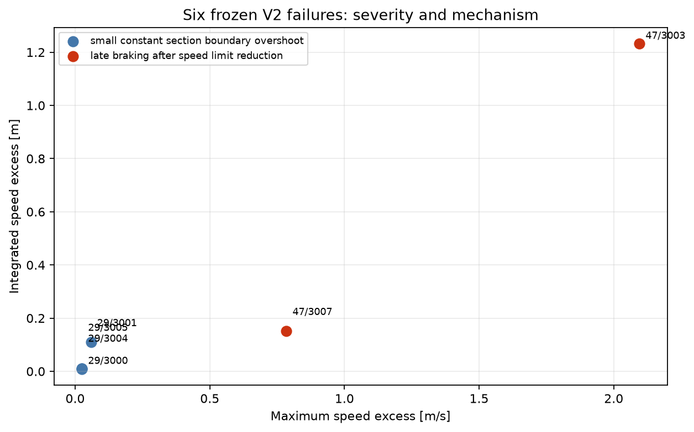
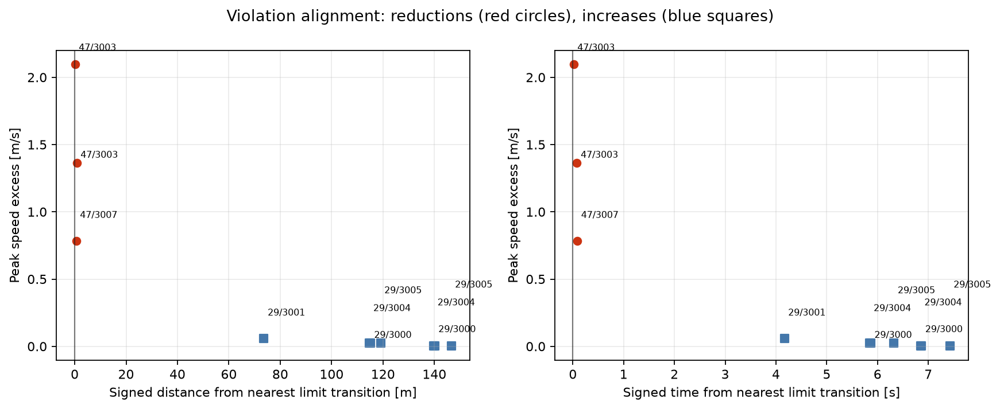
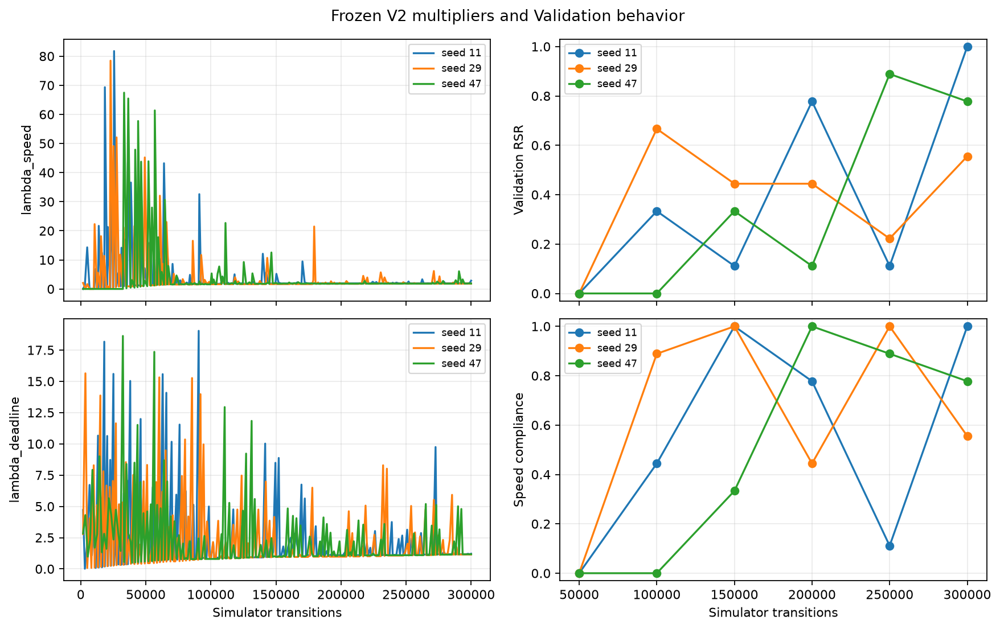

# Constrained RL V2 speed-failure diagnosis

## Outcome

The result is **Decision Gate F: mixed / no single intervention follows**.
Constrained RL V2 remains a strong but not credible baseline at 21/27, and is
now frozen. No V2.1 training was run.

Four failed episodes from seed 29 are small constant-section boundary-tracking
overshoots. Two failed episodes from seed 47 contain meaningful late braking
immediately after downward speed-limit changes. A training margin alone would
not fix late braking; an anticipatory-braking cost alone would not fix the four
constant-section failures. Combining both would violate the one-intervention
rule and amount to another shaping iteration.

## The six failures

| Training seed | Track | Time [s] | Energy [kWh] | Events | Max excess [m/s] | Integrated excess [m] | Mechanism |
|---:|---:|---:|---:|---:|---:|---:|---|
| 29 | 3000 | 99.7 | 0.259942 | 2 | 0.025216 | 0.009464 | small constant-section overshoot |
| 29 | 3001 | 73.7 | 0.241714 | 1 | 0.058685 | 0.109951 | small constant-section overshoot |
| 29 | 3004 | 78.5 | 0.248289 | 2 | 0.025314 | 0.009731 | small constant-section overshoot |
| 29 | 3005 | 87.8 | 0.236423 | 2 | 0.025129 | 0.009325 | small constant-section overshoot |
| 47 | 3003 | 130.6 | 0.181795 | 2 | 2.095243 | 1.232129 | late braking after reductions |
| 47 | 3007 | 123.5 | 0.183211 | 1 | 0.784236 | 0.151919 | late braking after reduction |

The same-seed comparison tracks selected from fixed physical-layout features
are 3003/3002/3002/3002 for the four seed-29 failures and 3000/3005 for the two
seed-47 failures, respectively.

## Severity

There are ten contiguous violation events. Across them:

- peak excess ranges from 0.001391 to 2.095243 m/s (median 0.025265 m/s);
- integrated excess ranges from 0.000318 to 0.845889 m;
- duration ranges from 0.3 to 3.6 s (median 0.6 s);
- violating distance ranges from 1.85 to 80.11 m.

The four seed-29 episodes contribute only 0.138471 m integrated excess. Their
peaks are at most 0.058685 m/s, although track 3001 remains marginally above its
limit for 3.6 s. These are small boundary errors, not numerically zero.

The two seed-47 episodes contribute 1.384048 m, about 91% of all failed-episode
integrated excess. Peaks of 0.784 and 2.095 m/s are operationally meaningful.
The external zero-tolerance benchmark remains unchanged for both groups.

## Speed-limit transitions

All three seed-47 events start 0.013--0.088 s and 0.10--0.78 m after a downward
limit crossing:

- track 3003 at 100 m: 50 to 30 km/h;
- track 3003 at 400 m: 40 to 20 km/h;
- track 3007 at 800 m: 40 to 20 km/h.

The policy begins strong braking only after the new limit becomes current. This
is late braking, not sustained aggressive speeding.

The seven seed-29 events occur 4.17--7.42 s and 73.64--146.55 m after an upward
transition, on constant 80/90 km/h sections. They are not caused by downward
limit changes; the policy tracks the legal boundary too closely and crosses it
slightly.

## Deadline interaction

None of the 85 violating native steps has a positive deadline deficit. The
minimum deadline slack at a violating step is 20.0002 s; event-start slack spans
20.0--72.9 s. `deadline_cost` is therefore zero for every speed event.

Speed excess and slack have a descriptive Pearson correlation of -0.359 over
violating samples, while correlation with deadline deficit is undefined because
the deficit is identically zero. The evidence does not support a
deadline-pressure -> aggressive action -> speeding chain, and correlation is
not interpreted causally.

## Lagrange behavior and checkpoint stability

Final `(lambda_speed, lambda_deadline)` values are:

| Seed | lambda_speed | lambda_deadline | Final RSR |
|---:|---:|---:|---:|
| 11 | 2.8477 | 1.2153 | 9/9 |
| 29 | 1.8255 | 1.1565 | 5/9 |
| 47 | 1.8750 | 1.1716 | 7/9 |

The speed multiplier exceeds the deadline multiplier at the final checkpoint
for every seed. During training it rises and falls rather than saturating; its
maxima are 81.77, 78.46, and 67.46. Deadline multipliers peak at 19.04, 15.64,
and 18.63. Seed 29 is not uniquely dominated by `lambda_deadline`, and seed 47
has almost the same final multipliers despite a different physical failure.

Validation RSR varies substantially by checkpoint. That warns against claiming
universal optimization stability, but the final failures themselves separate
into repeatable physical patterns rather than unexplained oscillatory behavior.

## Seed, track, and smoothness findings

Failures occur only for seeds 29 (four) and 47 (two); seed 11 is 9/9. The six
tracks are 3000, 3001, 3003, 3004, 3005, and 3007. No track fails for more than
one policy, so the outcome is seed-policy-specific rather than a small set of
universally impossible tracks.

Failed episodes have higher mean action variance (0.197 vs 0.095), action total
variation (20.38 vs 17.18), and maximum absolute jerk (45.43 vs 33.09 m/s³)
than successful episodes. Maximum acceleration is essentially identical. These
pooled differences are confounded by policy and geometry and do not establish a
general instability mechanism. The seed-47 event windows instead show smooth
approach followed by braking one control step too late.

Detailed +/-15 s plots are stored in `plots/event-windows-*.png`; the shaded
region is the violation and the dashed line is the nearest limit crossing.

## Answers to the study questions

1. The failed `(training seed, track)` pairs are `(29,3000)`, `(29,3001)`,
   `(29,3004)`, `(29,3005)`, `(47,3003)`, and `(47,3007)`.
2. Four are physically tiny boundary errors; two are meaningful violations.
3. Only the three meaningful events are concentrated at downward transitions.
4. No: every violating step has zero deadline deficit and at least 20 s slack.
5. Multipliers react strongly and do not saturate; the deadline multiplier does
   not dominate. Final speed multipliers are lower for the two failing policies.
6. Failures are seed-policy-specific and not repeated on the same tracks.
7. The dominant classification is F: two distinct mechanisms remain.
8. No single V2.1 intervention is scientifically justified.
9. No intervention was implemented and no training was launched.
10. V2.1 therefore has no RSR; frozen V2 remains 21/27, below 24/27.
11. Completion and deadline remain the frozen V2 values, both 27/27.
12. Yes. Further SACLag constraint shaping has diminishing scientific value.
13. Yes. The next justified stage is a separately preregistered
    Requirement-Conditioned RL study.

The complete machine-readable episode, event, distribution, correlation,
multiplier, and checkpoint record is in `diagnosis.json`.

