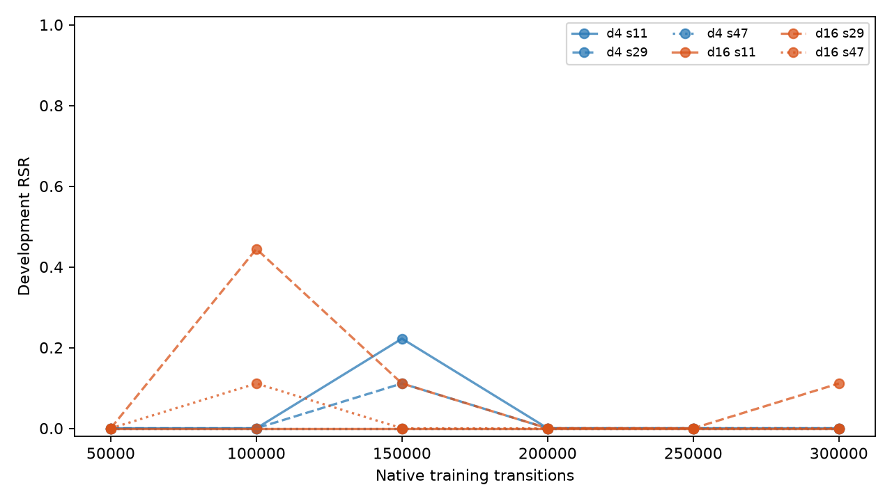
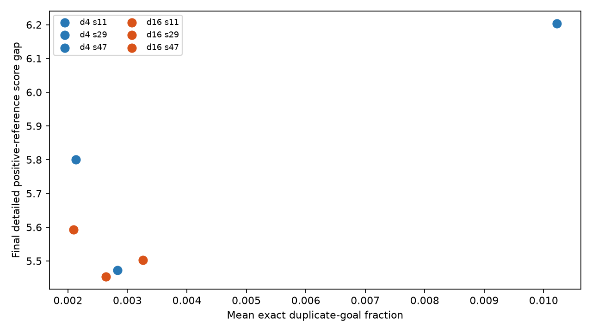
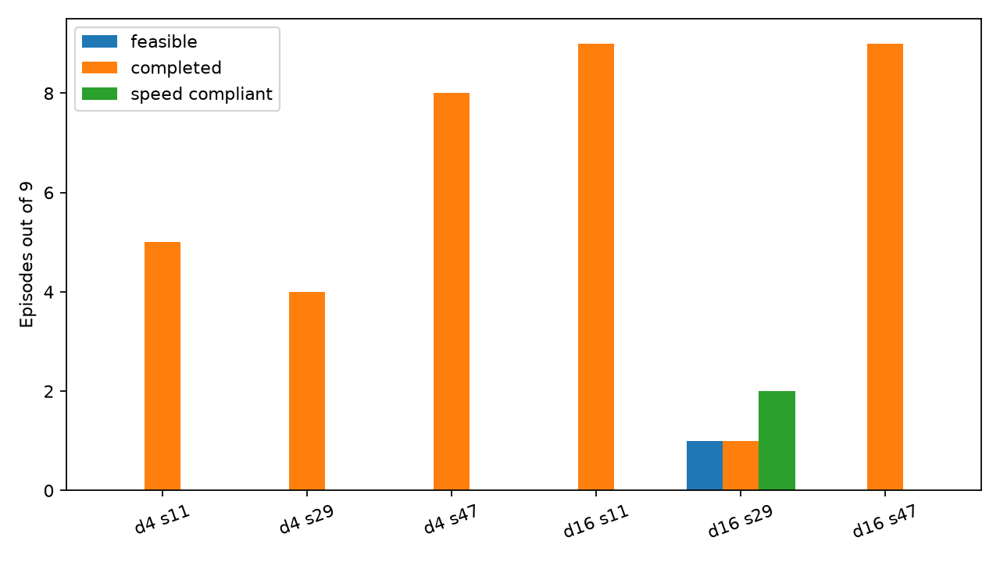

# Projected-goal Contrastive RL results

The frozen first-tier study is complete. Six independently trained policies
received exactly 300,000 native simulator transitions and 7,250 complete
actor/alpha/critic update cycles each. Their final 300k checkpoints were then
evaluated once on Validation tracks 3000--3008 with deterministic actions and
the canonical command `[1,1,1]`.

## Primary result

| Depth | Validation RSR | Completed | Completed by 140 s | Strict speed compliance | Feasible energy |
|---:|---:|---:|---:|---:|---:|
| 4 | 0/27 (0.0%) | 17/27 | 17/27 | 0/27 | null |
| 16 | 1/27 (3.7%) | 19/27 | 19/27 | 2/27 | 0.13555 kWh (one feasible episode) |

Per training seed:

| Policy | Parameters | RSR | Completed | By deadline | Speed compliant | Failure modes |
|---|---:|---:|---:|---:|---:|---|
| depth 4, seed 11 | 839,299 | 0/9 | 5/9 | 5/9 | 0/9 | speed 5; incomplete+deadline+speed 4 |
| depth 4, seed 29 | 839,299 | 0/9 | 4/9 | 4/9 | 0/9 | speed 4; incomplete+deadline+speed 5 |
| depth 4, seed 47 | 839,299 | 0/9 | 8/9 | 8/9 | 0/9 | speed 8; incomplete+deadline+speed 1 |
| depth 16, seed 11 | 3,226,243 | 0/9 | 9/9 | 9/9 | 0/9 | speed 9 |
| depth 16, seed 29 | 3,226,243 | 1/9 | 1/9 | 1/9 | 2/9 | feasible 1; incomplete+deadline 1; incomplete+deadline+speed 7 |
| depth 16, seed 47 | 3,226,243 | 0/9 | 9/9 | 9/9 | 0/9 | speed 9 |

Depth 16 produced one additional success, but it occurred in only one of three
training seeds and on only one of nine tracks for that seed. This is not a
repeatable improvement across seeds. Completion was much more common than
feasibility; strict speed compliance was the dominant bottleneck. Among
incomplete Validation episodes, mean terminal route progress was 91.95% for
depth 4 (10 episodes) and 89.99% for depth 16 (8 episodes); the episode-level
values remain in `results.json`.

## Training and Development behavior

All policies encountered physically feasible episodes during stochastic
training. Those outcomes supplied genuine canonical future positives; they
were not relabelled successes. Final deterministic behavior did not preserve
that training success reliably.

| Policy | Ended training episodes | Canonical training successes | First success transition | Development successes at 50k/100k/150k/200k/250k/300k |
|---|---:|---:|---:|---|
| depth 4, seed 11 | 300 | 19 | 122,462 | 0 / 0 / 2 / 0 / 0 / 0 |
| depth 4, seed 29 | 277 | 19 | 123,146 | 0 / 0 / 1 / 0 / 0 / 0 |
| depth 4, seed 47 | 296 | 15 | 136,041 | 0 / 0 / 0 / 0 / 0 / 0 |
| depth 16, seed 11 | 290 | 21 | 22,681 | 0 / 0 / 0 / 0 / 0 / 0 |
| depth 16, seed 29 | 280 | 27 | 28,220 | 0 / 4 / 1 / 0 / 0 / 1 |
| depth 16, seed 47 | 261 | 21 | 52,444 | 0 / 1 / 0 / 0 / 0 / 0 |

Development success appeared transiently rather than increasing monotonically.
The final checkpoint was fixed at 300k and was not selected from Development.

## Contrastive diagnostics

| Policy | First sampled canonical positive | Batches with canonical positive | Mean duplicate-goal fraction | Mean pair-collision rate | Final positive-reference score gap |
|---|---:|---:|---:|---:|---:|
| depth 4, seed 11 | 124,360 | 4.00% | 0.283% | 0.0026% | 5.473 |
| depth 4, seed 29 | 123,320 | 3.99% | 1.016% | 0.0233% | 6.203 |
| depth 4, seed 47 | 139,000 | 2.40% | 0.207% | 0.0018% | 5.800 |
| depth 16, seed 11 | 23,200 | 5.89% | 0.264% | 0.0024% | 5.454 |
| depth 16, seed 29 | 28,440 | 8.54% | 0.326% | 0.0032% | 5.502 |
| depth 16, seed 47 | 53,120 | 5.49% | 0.209% | 0.0017% | 5.593 |

No learning batch had all projected goals identical, every final optimization
diagnostic was finite, and mean batches contained roughly 253--255 distinct
projected goals out of 256. The earlier stationary collision stress case was
therefore not representative of these learned replay batches. The final score
gaps do show learned contrastive discrimination, but they do not order the
physical Validation results: the largest gap belongs to a 0/9 policy. Scores
are uncalibrated associations, and reference columns are samples from the
reference distribution rather than proven unreachable goals.

## Context against frozen studies

| Method | Canonical Validation successes |
|---|---:|
| Scalar SB3 SAC | 5/27 |
| Action-repeat scalar | 9/27 |
| Constrained V2 | 21/27 |
| Requirement-conditioned, canonical 140 s | 12/27 |
| Binary Success | 0/27 |
| LLM reward | 1/27 |
| Goal-conditioned SAC, no HER | 0/27 |
| Goal-conditioned SAC + HER | 0/27 |
| Projected-goal CRL, depth 4 | 0/27 |
| Projected-goal CRL, depth 16 | 1/27 |

These historical rows are contextual, not strict one-factor causal
comparisons: learners, representations, and update processes differ. The
strongest matched comparison in this study is depth 4 versus depth 16 under the
same projected-goal CRL protocol.

## Accounting and provenance

- Main training: 1,800,000 native simulator transitions and 43,500 complete
  update cycles.
- Development evaluation: 462,172 simulator transitions.
- Single final Validation: 54 episodes and 59,633 simulator transitions.
- Wall clock: 57.66 hours through training and 58.22 hours through Validation.
- Every policy completed in its first attempt; there were no interruptions or
  restarts.
- Validation was opened once only after all six final policies were frozen.
- Paper tracks 4000--4017 remained sealed.
- Canonical configuration SHA-256:
  `659e139034d9f3aed25a07d5244bc6ac4c86ce63dd0394f315ca5341ae0a78fc`.

Exact per-policy source/configuration/model hashes, RNG provenance, timestamps,
and resource counters are stored in `execution_manifest.json`. Compact
training, Development, diagnostic, and Validation summaries are in
`results.json`; all 54 stored Validation episodes are in
`validation_episodes.json`. Large checkpoints and replay buffers remain in the
ignored run directory and are not committed.

## Interpretation boundary

Under this projected-goal CRL adaptation, network depths, interaction budget,
and LongiControl task mapping, increasing depth from 4 to 16 did not yield a
robust canonical policy. The result does not disprove depth scaling or CRL in
general. The large-scale reference work uses approximately 100M--400M
transitions, while each policy here received 300k. The experiment also used an
explicit, requirement-aware projected goal; it was not reward-free in an
absolute sense and did involve task engineering.
