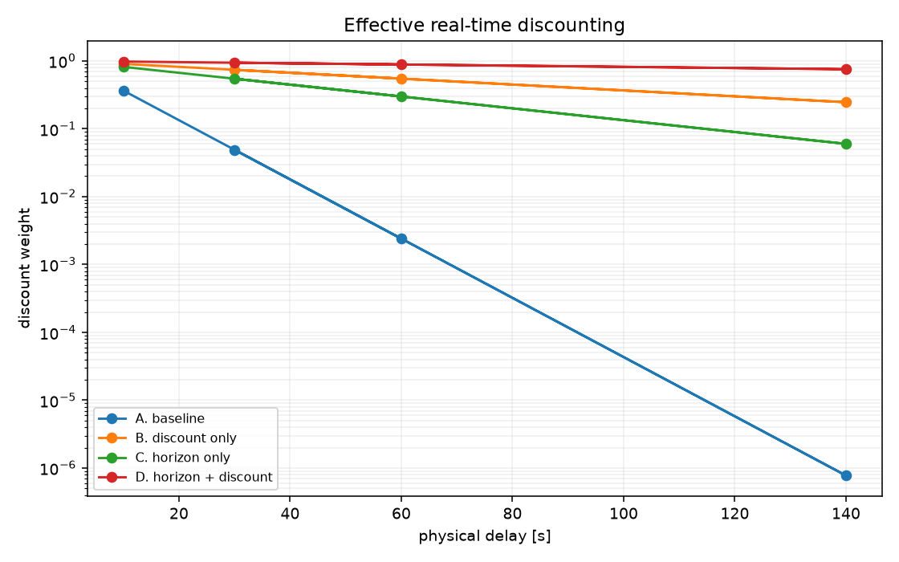
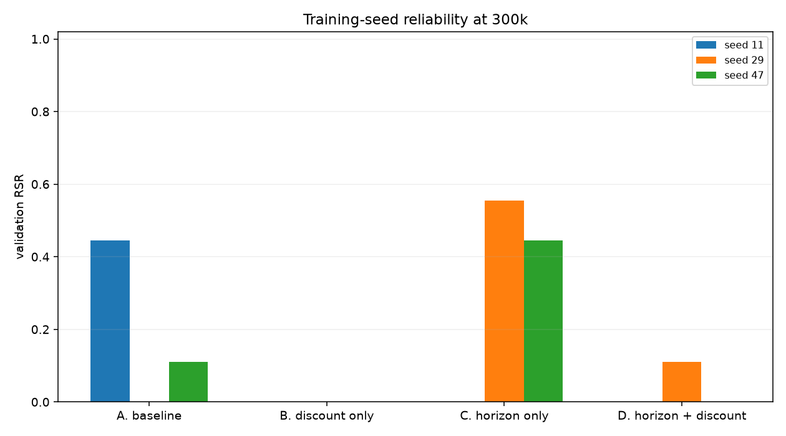
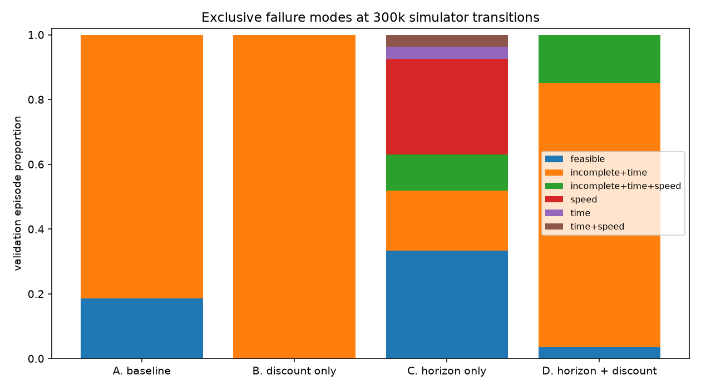
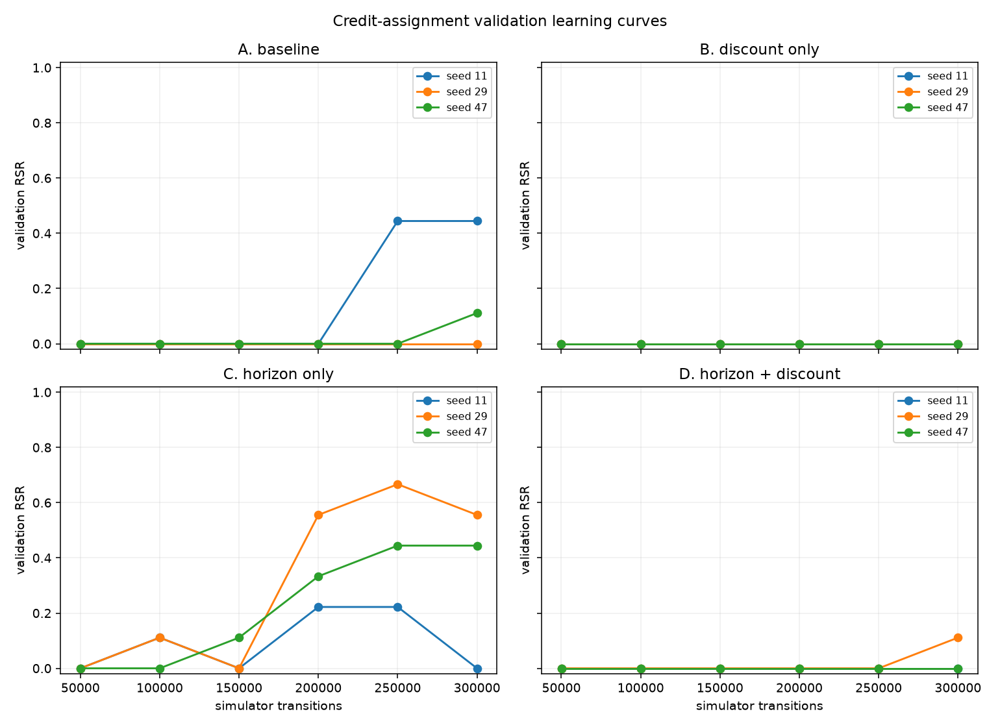
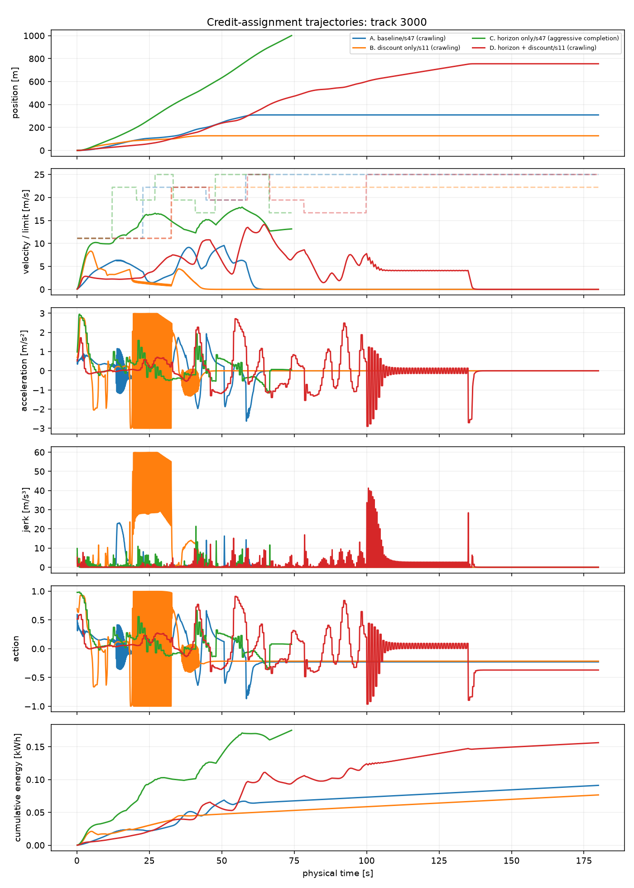
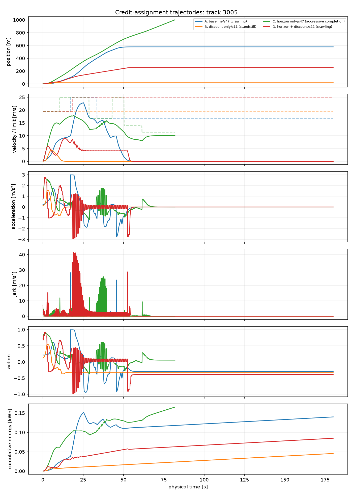

# Scalar credit-assignment diagnostic: results

## Outcome

The preregistered decision is **case E: none of the horizon interventions
materially improves robustness**.

Action repeat alone is the only direction with a positive aggregate signal: it
raises final validation RSR from 5/27 to 9/27 and completion from 5/27 to 19/27.
It nevertheless misses the predefined material gain, fails entirely for one
training seed, and exchanges some incomplete episodes for speed violations.
Increasing gamma to 0.999 does not help in this budget: discount-only reaches
0/27 feasible episodes and the combined condition reaches 1/27.

The result does **not** show that scalar rewards are fundamentally unsuitable or
that SAC cannot solve LongiControl. It shows that the obvious discount/decision
horizon changes do not turn the frozen Scalar V2-B formulation into a robust
baseline at 300k simulator interactions. Per the gate, further ad-hoc scalar
tweaking stops here; the next benchmark stage should formulate the requirements
explicitly as constraints or conditioning variables.

## Frozen design and provenance

The protocol was written before any main run. The task, V2-B reward, observation,
physics, 0.1 s integration step, seeds, data split, network, optimizer, replay
settings, and entropy configuration are identical across conditions. Only
action repeat and SAC gamma vary:

| Condition | Repeat | Gamma | Agent frequency |
|---|---:|---:|---:|
| A: baseline | 1 | 0.99 | 10 Hz |
| B: discount only | 1 | 0.999 | 10 Hz |
| C: horizon only | 5 | 0.99 | 2 Hz |
| D: horizon + discount | 5 | 0.999 | 2 Hz |

Each condition and training seed 11, 29, and 47 receives exactly 300,000
underlying simulator transitions. Evaluation uses development tracks 2000--2008
and validation tracks 3000--3008. Tracks 1000--1008 are not reused and sealed
tracks 4000--4017 are not touched. There are 144 validated result files:
4 conditions x 3 seeds x 6 checkpoints x 2 splits. Configuration SHA-256:
`79f269ac6b0eb9fc2a49fc30267c57332f6f1a267d01452f3c14bb887a800481`.

The optional terminal-credit condition was excluded before training because no
fixed terminal magnitude had a non-tuned justification. H3 is therefore not
tested by this study.

## Interaction accounting

Repeat is outside the unchanged V2 reward environment. It sums the native
per-step rewards, returns the last observation, and propagates termination or
truncation immediately. Physics, energy, speed checks, and `EpisodeMetrics`
continue to update at 10 Hz.

| Condition | Final simulator steps | Agent decisions by seed | Gradient updates by seed |
|---|---:|---|---|
| A | 300,000 | 300,000 / 300,000 / 300,000 | 299,899 / 299,899 / 299,899 |
| B | 300,000 | 300,000 / 300,000 / 300,000 | 299,899 / 299,899 / 299,899 |
| C | 300,000 | 60,038 / 60,043 / 60,047 | 59,937 / 59,942 / 59,946 |
| D | 300,000 | 60,006 / 60,007 / 60,004 | 59,905 / 59,906 / 59,903 |

Intermediate repeated checkpoints occur at the first decision ending at or
after their target and differ by at most four simulator steps. The final repeat
is shortened to land exactly on 300k. The small difference among Repeat-5
decision counts comes from immediate episode termination. SB3 updates once per
agent transition, so Repeat 5 intentionally also produces about one fifth as
many replay transitions and optimizer updates. This is part of lowering the
decision-frequency MDP, but should be separated in any follow-up optimization
study.

## Effective physical-time discount

The weight at physical delay `t` is
`gamma ** (t / (0.1 * action_repeat))`.

| Condition | 10 s | 30 s | 60 s | 140 s | Exponential time constant |
|---|---:|---:|---:|---:|---:|
| A | 0.3660 | 0.0490 | 0.0024 | 0.0000008 | 9.95 s |
| B | 0.9048 | 0.7407 | 0.5486 | 0.2464 | 99.95 s |
| C | 0.8179 | 0.5472 | 0.2994 | 0.0600 | 49.75 s |
| D | 0.9802 | 0.9417 | 0.8869 | 0.7557 | 499.75 s |

Thus C is already much less discounted in physical time despite retaining gamma
0.99 per decision. A physically time-matched Repeat-5 version of A would use
`0.99^5 = 0.9509900499`, not 0.99. That value was documented for interpretation
but not added to the frozen matrix.

## Final validation outcomes

RSR is reported per independent training seed; validation episodes are not
pooled as independent trained policies for inference.

| Condition | Seed RSR (11 / 29 / 47) | Mean | Range | Completion | Time compliant | Speed compliant |
|---|---|---:|---:|---:|---:|---:|
| A | 4/9 / 0/9 / 1/9 | 5/27 (0.185) | 4/9 | 5/27 | 5/27 | 27/27 |
| B | 0/9 / 0/9 / 0/9 | 0/27 (0.000) | 0 | 0/27 | 0/27 | 27/27 |
| C | 0/9 / 5/9 / 4/9 | 9/27 (0.333) | 5/9 | 19/27 | 17/27 | 15/27 |
| D | 0/9 / 1/9 / 0/9 | 1/27 (0.037) | 1/9 | 1/27 | 1/27 | 23/27 |

Development RSR at 300k is consistent in direction: A 4/27, B 0/27, C 9/27,
and D 2/27. No intervention approaches the acceptance requirement of at least
8/9 for every seed with a range no larger than 1/9.

### Failure modes

| Condition | Feasible | Incomplete + time | Speed only | Other mixed failures |
|---|---:|---:|---:|---:|
| A | 5 | 22 | 0 | 0 |
| B | 0 | 27 | 0 | 0 |
| C | 9 | 5 | 8 | 5 |
| D | 1 | 22 | 0 | 4 |

For paired condition-versus-A track outcomes, B regresses on five and improves
none; C improves eight, regresses four, and leaves fifteen unchanged; D improves
one and regresses five. C's gains are concentrated in seeds 29 and 47, while
seed 11 loses all four of A seed 11's previously feasible tracks. The effect is
therefore real for some trained policies but not robust across training seeds.

## Learning stability

- A remains at zero through 200k. Seed 11 reaches 4/9 at 250k and keeps it;
  seed 47 reaches 1/9 only at 300k; seed 29 remains at zero.
- B has zero RSR for every seed and checkpoint, despite occasional earlier
  completion that fails speed or time compliance.
- C learns earlier and more often, but is unstable. Seed 11 peaks at 2/9 at
  200k/250k and collapses to 0/9; seed 29 peaks at 6/9 at 250k and ends at 5/9;
  seed 47 reaches 4/9 at 250k and retains it.
- D remains at zero until seed 29 reaches 1/9 at the final checkpoint.

The C seed-11 collapse coincides with integrated speed violation rising from
0 m at 250k to a 3.46 m episode mean at 300k and mean maximum jerk rising from
26.7 to 30.0 m/s³. It does not coincide with an obvious final critic-loss
explosion: logged critic loss falls from 0.00319 to 0.00248 after an earlier
0.0120 spike at 200k. The entropy coefficient rises from 0.000656 to 0.00133.
These sparse logger snapshots support an aggressive-policy shift, not a causal
claim about critic failure. Q-value statistics were not added because obtaining
them would require more invasive SB3 instrumentation.

The high-gamma conditions have much larger-magnitude actor losses (about -2 for
B and -7 for D at the final checkpoint, versus near zero for A and around -0.7
for C). D seed 11 also has final critic loss 0.201 while the other final D seeds
are near 0.001. Higher gamma changes the learned value scale and does not prevent
the observed failure regime.

## Reproducible trajectory diagnostics

The preregistered selection uses the median-final-RSR seed per condition, with
the lowest seed breaking ties: A/47, B/11, C/47, and D/11. Tracks 3000 and 3005
are replayed at the native 10-Hz simulator resolution.

| Condition | Track 3000 | Track 3005 |
|---|---|---|
| A/47 | crawling, incomplete at 180 s | crawling, incomplete at 180 s |
| B/11 | crawling, incomplete at 180 s | standstill, incomplete at 180 s |
| C/47 | feasible in 74.1 s, 0.1751 kWh | feasible in 81.9 s, 0.1652 kWh |
| D/11 | crawling, incomplete at 180 s | crawling, incomplete at 180 s |

C's selected completions respect the speed limit but show sharp action changes
and high jerk peaks; they are classified as aggressive rather than smooth.
A and D make partial progress and then settle at zero speed. B approaches a
near-stationary low-energy policy. Low energy for these failed episodes is not
interpreted as efficiency.

## Energy after feasibility

No seed reaches the predefined 8/9 feasibility threshold, so **no condition is
eligible for an energy-efficiency ranking**. Descriptively, the small feasible
subsets have means of 0.1990 kWh for A (five episodes), 0.1829 kWh for C (nine),
and 0.2172 kWh for D (one). B has none. Only one A/C episode is paired feasible
within the same training seed and track; C uses 0.0365 kWh less there. That is
far too little paired coverage to support a comparative energy conclusion.

## Decision gate and next step

C's mean RSR gain over A is 0.148 (4/27), below the preregistered material gain
of 2/9 (0.222), even though two seeds improve. Its 5/9 seed range also greatly
exceeds the 1/9 stability limit. B and D are worse than A. The result therefore
maps to **E**, not F: no intervention first clears the material-improvement gate.

The experiment narrows the diagnosis:

- the original 10-Hz decision horizon contributes to difficulty for some seeds;
- insufficient discount horizon alone is not the dominant cause at this budget;
- combining very long physical-time discounting with Repeat 5 is not beneficial;
- delayed terminal credit remains untested, by design;
- optimization and compliance instability remain after the obvious horizon
  interventions.

The next research change should not be another scalar-reward or gamma sweep.
Proceed to a dedicated benchmark environment that exposes the already frozen
task requirements for explicit constrained-RL and later
requirement-conditioned baselines. If Repeat 5 is adopted for those baselines,
first freeze whether optimizer updates are matched per decision or per simulator
transition and use a physical-time discount convention.

## Reproduction artifacts

- [`PROTOCOL.md`](PROTOCOL.md): preregistration and decision rule.
- [`canonical.json`](canonical.json): frozen machine-readable configuration.
- [`results.json`](results.json): compact checkpoint, per-seed, paired-track,
  accounting, discount, diagnostic, and energy summary.
- `runs/credit-assignment-20260926/`: ignored raw checkpoints, 144 episode-level
  results, complete analysis JSON, logger histories, and 10-Hz trajectory JSON.

The complete test suite and Ruff are rerun after finalizing these artifacts.
